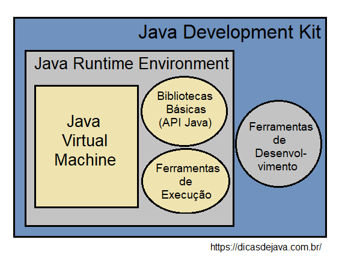
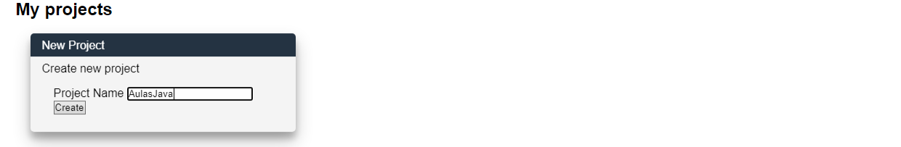
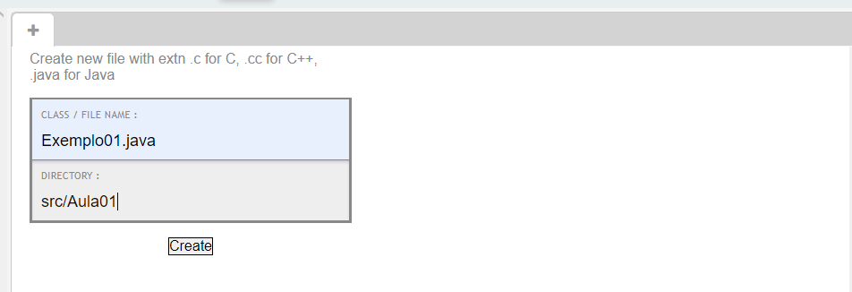

# Aula 01 - 12/05/21

## Linguagem Java
- A Linguagem Java é usada para desenvolver aplicativos para uma ampla variedade de ambientes: Dispositivos móveis, Sistemas WEB, Aplicações Corporativas, Sistemas Embarcados.
- É uma linguagem Orientada a Objetos
- Baseada na linguagem C( Fortemente tipada)
- É uma linguagem compilada:
  - 
    - O código fonte(``.java``) é passa pelo processo de Compilação(``javac``). 
    - Toda vez que há uma alteração é necessária uma nova compilação, para gerar um novo código objeto(*bytecode*).
    - Bytecode é um conjunto de instruções destinadas a executar em uma Java virtual machine (JVM)
    - JVM (Java Virtual Machine): lê e interpreta arquivos .class e executa as instruções do programa na plataforma de hardware nativa para qual a JVM foi escrita.
    - Linguagem Compilada x Interpretada: https://pt.stackoverflow.com/questions/77070/qual-a-diferença-entre-linguagem-compilada-para-linguagem-interpretada#:~:text=A%20grande%20diferença%20entre%20ambos,virtual%20ou%20uma%20máquina%20real.

## JDK e JRE
- JDK (Java Development Kit) - é o Kit de Desenvolvimento Java responsável por compilar código-fonte (.java) em bytecode (.class)
- O JRE(Java Runtime Environment) Ambiente de execução JAVA. Ele contém uma JVM, os pacotes básicos do Java (API core)
- 
    
## Codiva
- Vamos utilizar uma IDE online para programar em JAVA: https://www.codiva.io
  - Crie uma conta no site.
  - Crie um novo projeto chamado AulasJava:
    - 


## Exemplo01.java
  - Crie um arquivo em ``/src/Aula01/Exemplo01.java``
    - 
```java
package Aula01;
class Exemplo01 {
  public static void main(String[] args) {
    
    System.out.println("Hello Codiva");
  }
}
```
### Definindo o pacote:
```java 
package Aula01; 
```
* Setando o pacote onde a classe será guardada. O pacote normamelmente é definido pelas pastas onde o arquivo se encontra

### Definindo a classe:
```java 
class Exemplo01{
```
* Tudo em java é orientado a objetos. Para criar um "Ola mundo!", é preciso definir uma classe. 
* Nome do Arquivo == Nome da Classe.
### Método main(): Método que a JVM(Java Virtual Machine) irá executar
```java 
    public static void main(String[] args){
```
Este método tem as seguintes configurações:
*  `public`: Define o método main como público. 
    - Atributos -> **privados**
    - Métodos -> **públicos**. 
* `static`: define um **método de classe**
    - não é preciso instanciar um objeto para chamá-lo
* `void`: define que o **método não retorna valores**
    - Java é uma linguagem fortemente tipada. 
    - Atributos/variáveis tem tipos
    - Métodos tem tipos de retorno
* `String[] args`: Parâmetro do método main(). 
    - Argumentos que são passados na execução do código java.
### 4. Método println(): Impressão no console
```java 
    System.out.println("Hello Codiva");
```
* `System`: É uma classe(Letra maiúscula). Fornece métodos de saída e entrada de dado.
* `out`: É um atributo da classe `System`. Acesso a saída de dados padrão. No nosso caso, o console.
* `println()`: Método para impressão dos dados. Observe que é um método estático, pois não foi necessário instanciar nenhum objeto para acessá-lo
* **NÃO ESQUECER** DO `;`
# 
## Tipos e Classes Básicas

#
## Tipos e Classes Básicas:

#
## Variáveis
- 
- 
## Exemplo02.java
- Crie um novo arquivo em ``src/Aula01/Exemplo02.java``
```java 
package Aula01;
import java.util.Scanner;

class Exemplo02{
    public static void main(String[] args) {
      Scanner scan = new Scanner(System.in);
      int num1, num2, op;
      System.out.println("Digite a operação:");
      System.out.println("1 - Somar");
      System.out.println("2 - Dividir");
      System.out.println("3 - Multiplicar");
      System.out.println("4 - Dividir");
      System.out.println("5 - Resto");
      op = scan.nextInt();
      System.out.println("Digite o primeiro numero:");
      num1 = scan.nextInt();
      System.out.println("Digite o segundo numero:");
      num2 = scan.nextInt();
      if(op==1){
        System.out.println("A soma é: "+(num1+num2));
      }else if(op==2){
        System.out.println("A subtração é: "+(num1-num2));
      }else if(op==3){
        System.out.println("A multiplicao é: "+(num1-num2));
  
      }else if(op==4){
        System.out.println("A divisão é: "+((float)num1/(float)num2));
      }else if(op==5){
        System.out.println("O resto é: "+(num1%num2));
      }
    }
  }  
```

### Importando classe 
```java
import java.util.Scanner;
```
- Importando a classe `Scanner` do pacote `java.util`
### Instanciando um objeto


- `Scanner`: Classe que permite fazer leitura de dados do teclado
- `scan`: objeto instanciado
- `new`: Palavra chave para instanciar um objeto
- `Scanner(System.in)`: Chamando método construtor. Observe que o objeto `System.in` é passado como parâmetro.
### Declarando variáveis.
```java
    int num1, num2, op;
```

### Método nextInt()
```java
op = scan.nextInt();
```
Fazendo a leitura de dados no console. Observe que foi utilizado o objeto `scan`, para chamar o método `nextInt()`. Esse método lê o próximo **inteiro** que for inserido no console

### Lógica do programa
```java
      if(op==1){
        System.out.println("A soma é: "+(num1+num2));
      }else if(op==2){
        System.out.println("A subtração é: "+(num1-num2));
      }else if(op==3){
        System.out.println("A multiplicao é: "+(num1*num2));
  
      }else if(op==4){
        System.out.println("A divisão é: "+((float)num1/(float)num2));
      }else if(op==5){
        System.out.println("O resto é: "+(num1%num2));
      }
    }
```
Nesta parte é desenvolvida a lógica do programa. Dependendo do valor que a variável `op`, o programa irá fazer uma determinada operação.
### Concatenação e Conversão de tipos
```java
    ...
        //Concatenação
        System.out.println("A multiplicao é: "+(num1*num2));
    ...
        // (int -> float)
        System.out.println("A divisão é: "+((float)num1/(float)num2));
    ...
```
- Concatenação de String: `+`
- Conversão de Tipos: `(float) num1` -> Tipos **devem ser compatíveis**
#
## Exemplo03.java
- Neste exemplo vamos trabalhar com Strings em Java
```java
package Aula01;
import java.util.Scanner;

public class Exemplo03 {
    public static void main(String[] args) {
        Scanner scan = new Scanner(System.in);
        String nome1,nome2;
        System.out.println("Digite o primeiro nome");
        nome1 = scan.nextLine();
        System.out.println("Digite o segundo nome");
        nome2 = scan.nextLine();
        
        if(nome1.equals(nome2)){
            System.out.println("Nomes são iguais!!");
        }else{
            System.out.println("Nomes são diferentes");
        }

    }
}
```

### Classe String
```java
String nome1,nome2;
```
- String não é um tipo primitivo, mas sim uma classe.
- Nesta linha estamos declarando dois objetos do tipo string

### Método nextLine()
```java
    System.out.println("Digite o primeiro nome");
    nome1 = scan.nextLine();
    System.out.println("Digite o segundo nome");
    nome2 = scan.nextLine();
```
- O método nextLine() faz parte da classe Scanner
- Ele retorna em uma String, o que o usuário escrever no terminal
- Observe que não é necessário instanciar `nome1,nome2`

### 3. Método equals()
```java
    if(nome1.equals(nome2)){
```
- O método equals serve para comparar duas Strings
- Observe que este método é chamado a partir de um objeto String (`nome1`)
- O método recebe como parâmetro um outro objeto do tipo String (`nome2`)

#
## Exercício: [Exercício 01.pdf](Exercicios.pdf)

# Referências
- http://pedrofcarvalho.com.br/wp/wp-content/uploads/2016/08/Introduação-à-Linguagem-Java-Slides.pdf
- https://developer.ibm.com/br/tutorials/j-introtojava1/