# Aula 02 - 22/10/20
## Paradigma Orientado a Objetos
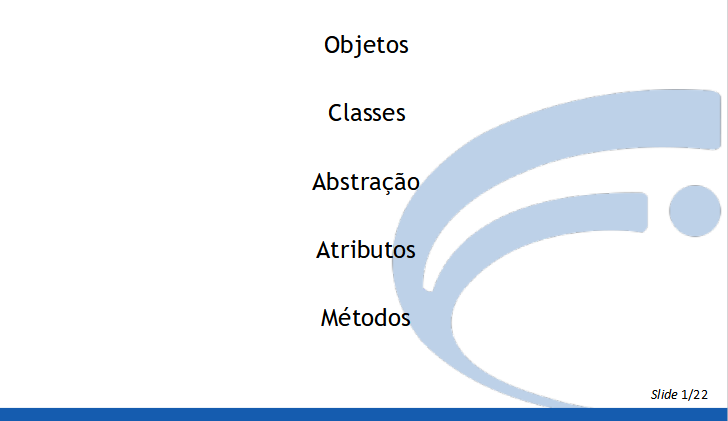
#
## Conceitos de Orientação a Objetos
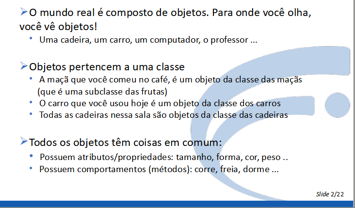
#
## Exemplos de objetos

#
## Classe
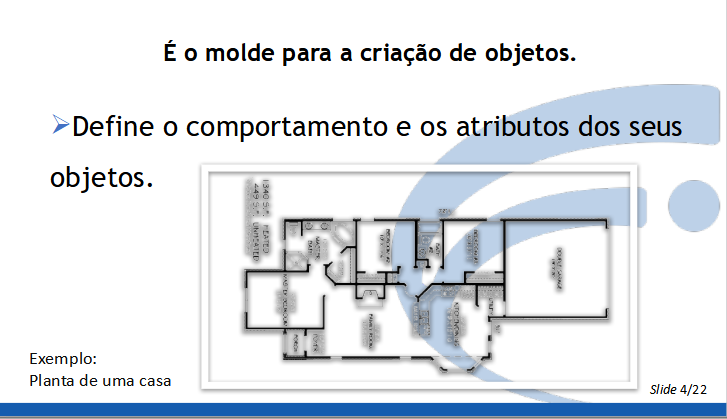
#
## Objeto

#
## Notação UML
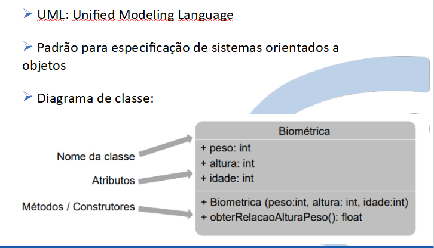
#
## Exemplo Classe-Objeto
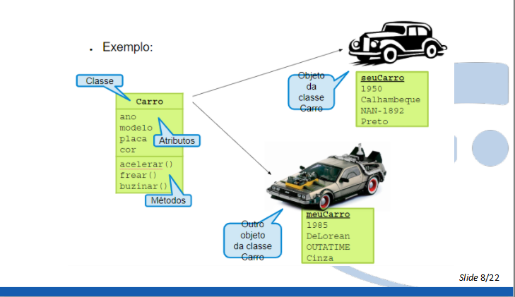
# 
## Exemplo01.java : Criação de classes
- Neste exemplo, vamos criar uma classe **Estudante.java** que será utilizado por outro arquivo **Exemplo04.java**
```java
//Aula01/classes/Estudante.java
package Aula02.classes;

public class Estudante {
    private String matricula;
    private String nome;
    private double[] notas;
    private String dataMatricula;

    public Estudante(String matricula,String nome,double[] notas){
        this.matricula = matricula;
        this.nome = nome;
        this.notas = notas;
    }
    public String getDataMatricula(){
        return this.dataMatricula;
    }
    public void setDataMatricula(String dataMatricula){
        this.dataMatricula = dataMatricula;
    }

    public void imprime(){
        System.out.println(this.matricula);
        System.out.println(this.nome);
        System.out.println(this.dataMatricula);
        for(int i=0; i<this.notas.length ; i++){
            System.out.println("Nota: "+this.notas[i]);
        }
    }
}
```
<p align="center"><b>Estudante.java</b></p>

### Definição da classe e dos atributos
```java
public class Estudante {
    private String matricula;
    private String nome;
    private double[] notas;
    private String dataMatricula;
```
- Observe que a classe foi definida como pública(`public class Estudante {`). Isto foi feito para conseguir acessar a classe fora do pacote `Aula01.classes;`
- Os atributos foram definidos como privados. Ou seja, não é possível acessar os atributos fora da classe `Estudante.

### 2. Construtor
```
    public Estudante(String matricula,String nome,double[] notas){
        this.matricula = matricula;
        this.nome = nome;
        this.notas = notas;
    }
```
- O método construtor é executado quando um objeto é instanciado.
- Esse método é utilizado para inicializar os atributos.
- A quantidade de parâmetros e seus tipos definem a **assinatura** de um método. A assinatura do método acima é: ` (String, String, double[])`
- Observe que para acessar os atributos usa-se a palavra-chave **this**. 

### 3. Getters and Setters
```java
    public String getDataMatricula(){
        return this.dataMatricula;
    }
    public void setDataMatricula(String dataMatricula){
        this.dataMatricula = dataMatricula;
    }
```
- `getDataMatricula()`: É um método **get**. Esse método retorna o atributo `private String dataMatricula`. Note que o método deve foi definido como `public String`, ou seja é público e retorna uma String. 
- `setDataMatricula(String Matricula)`: É um método **set**. Esse método altera o valor de um atributo. 

### 4. Método imprime()
```java
    public void imprime(){
        System.out.println(this.matricula);
        System.out.println(this.nome);
        System.out.println(this.dataMatricula);
        for(int i=0; i<this.notas.length ; i++){
            System.out.println("Nota: "+this.notas[i]);
        }
    }
```
- Este método acessa os atributos e imprime os valores de um estudante. É
- Observe que o método é do tipo **`void`**, logo ele não retorna nenhum valor. Neste caso, estamos apenas imprimindo os valores.

### 5. Agora vamos criar o código que irá utilizar a classe `Estudante`
```java
package Aula02;
import Aula02.classes.Estudante;
public class Exemplo02 {
    public static void main(String[] args) {
        double[] n1 = {5,7,8};
        double[] n2 = {8,9,5};  
        Estudante e1 = new Estudante("111","Matheus",n1);
        Estudante e2 = new Estudante("222", "Victória", n2);

        e1.setDataMatricula("21/10/2020");
        e2.setDataMatricula("20/10/2020");
        //System.out.println(e1.dataMatricula); -> erro
        //System.out.println(e1.getDataMatricula())

        e1.imprime();
        System.out.println("-------------------------------");
        e2.imprime();

    }
}

```
<p align="center"><b>Exemplo04.java</b></p>

### 6. Definição do método main()
```java
package Aula02;
import Aula02.classes.Estudante;
public class Exemplo02 {
    public static void main(String[] args) {
        ...
```
- Nesta parte foi definido o pacote e importada a classe Estudante. Isto só foi possível, pois a classe `Estudante` é pública.
- Observe que foi declarado o método main(). Logo a classe a ser executada é `Exemplo01`

### 7. Instanciando objetos
```java
...
    double[] n1 = {5,7,8};
    double[] n2 = {8,9,5};  
    Estudante e1 = new Estudante("111","Matheus",n1);
    Estudante e2 = new Estudante("222", "Victória", n2);
...
```
- Acima foram instanciados 2 objetos(`e1`,`e2`) da classe Estudante.
- Observe que a ordem dos parâmetros devem "bater" com a assinatura do construtor.
- `n1` e `n2` são os vetores que armazenam a nota.

### 8. Utilização dos getters and setters
```java
        e1.setDataMatricula("21/10/2020");
        e2.setDataMatricula("20/10/2020");
        //System.out.println(e1.dataMatricula); -> erro
        //System.out.println(e1.getDataMatricula()) 
```
- Nesta linha estamos setando o valor do atributo dataMatricula, através de um *setter*.
- Como os atributos são privados, não é possível acessá-los diretamente.
- Para fazer isso utilizamos os getters e setters, como mostra os comentários

### 9. Chamando método imprime()
```java        
        e1.imprime();
        System.out.println("-------------------------------");
        e2.imprime();
```
- Estamos fazendo a chamada do método imprime para cada um dos objetos

## Exemplo 04 - Parte 02
### 1. Agora vamos adicionar um método e um atrito estático na classe Estudante.java
```java
    ...
    private double[] notas;
    private String dataMatricula;
 -> private static int NUM_ESTUDANTES=0;

 -> public static int getNumEstudantes(){
        return Estudante.NUM_ESTUDANTES;
    }
    ...
```
- Definimos um atributo privado estático `NUM_ESTUDANTES` e um método getter `getNumEstudantes()` que também é estático.
- Isto significa, que não é preciso instanciar um objeto para acessá-los.
- Observe que o atributo foi inicia do com 0.

### 2. Refatorando construtor
```java
    ...
    public Estudante(String matricula,String nome,double[] notas){
        this.matricula = matricula;
        this.nome = nome;
        this.notas = notas;
    ->  Estudante.NUM_ESTUDANTES++;
    }
    ...
```
- Observe que incrementamos o valor de `NUM_ESTUDANTES` no final do construtor.
- Com isso, toda vez que um estudante for instanciado, será adicionado +1 em `NUM_ESTUDANTES`
- Um erro comum, é achar que um atributo estático não pode mudar de valor, o que não é o caso. 
- Para esta situação podemos utilizar a palavra `final`, que cria uma constante. Este recurso será demonstrado depois

### 3. Refatorando o Exemplo04.java
```java     
        e1.imprime();
        System.out.println("-------------------------------");
        e2.imprime();
  ->    System.out.println("Nº Total Estudantes: "+Estudante.getNumEstudantes()); 
```
- Estamos realizando a chamada do método estático
- Saída:

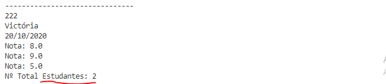

### Caso adicionemos uma nova instância, o valor do atributo estático será mudado.
```java   
    //Exemplo01.java
    ...
    ->  double[] n3 = {6,6,6};
        Estudante e1 = new Estudante("111","Matheus",n1);
        Estudante e2 = new Estudante("222", "Victória", n2);
    ->  Estudante e3 = new Estudante("333","Lucas", n3);
```
Ao se executar o exemplo obtém-se o seguinte resultado:

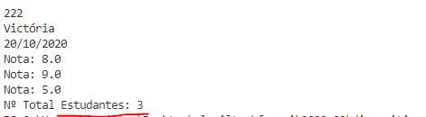

### 4. Adicionando uma constante (**final**)
```java
    //Estudante.java
    ...
    private String dataMatricula;
    private static int NUM_ESTUDANTES=0;
->  public static final int MAX_ESTUDANTES=5;
```
- Neste caso adicionamos um atributo que o seu valor não pode ser alterado, ou seja, uma **CONSTANTE**. 
- Na maioria dos casos, as constantes em java são públicas e estáticas.

### 5. Refatorando construtor:
```java
    ...
    public Estudante(String matricula,String nome,double[] notas){
        if(NUM_ESTUDANTES >= MAX_ESTUDANTES){
            System.out.println("Já atingiu o maximo de estudantes!");
            return;
        }
        this.matricula = matricula;
    ...
```
- Adicionamos uma lógica que o construtor verifica se  já atingiu o número maximo de estudantes
- Caso tenha atigindo, os valores não são iniciados.
### Refatorando Exemplo04.java
```java
public static void main(String[] args) {
        double[] n1 = {5,7,8};
        double[] n2 = {8,9,5};
        double[] n3 = {6,6,6};
        Estudante e1 = new Estudante("111","Matheus",n1);
        Estudante e2 = new Estudante("222", "Victória", n2);
        Estudante e3 = new Estudante("333","Lucas", n3);
    ->  Estudante e4 = new Estudante("444", "Rebeca",n1);
    ->  Estudante e5 = new Estudante("555", "Fabricio",n2);
    ->  Estudante e6 = new Estudante("666", "Lazaro",n3);
        
        e1.setDataMatricula("21/10/2020");
        e2.setDataMatricula("20/10/2020");
```
- Ao se executar o código acima, será mostrado a mensagem de máximo estudantes.
- Porém o objeto `e6`, ainda será instanciado, apenas seus valores que não terão valores.
- Podemos resolver esse problema através de um método estático. Vamos ver isso mais na frente.

## Exemplo 02
### 1. Vamos fazer um classe `Conta` que implemente o seguinte diagrama de classe
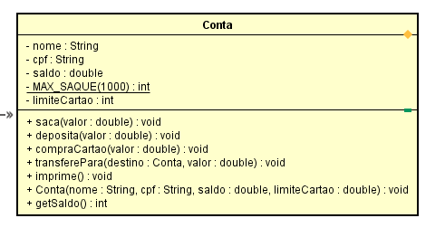

### A classe de seguir as seguintes funcionalidades:
- Os atributos são privados e métodos são públicos
- O atributo MAX_SAQUE é uma constante estática, e recebe valor 1000.
- O método construtor(`Conta()`), é responsável por iniciar os atributos.
- - O método `getSaldo()`, retorna o saldo atual da conta.
- O método `saca(valor)`, diminui o saldo da conta. Caso o valor seja maior que o saldo, retorne uma mensagem de aviso.
- O método `deposita(valor)`, acrescenta um saldo na conta.
- O método `compraCartao(valor)`, diminui o limite do cartão. Caso a compra for maior que o limite, retorne uma mensagem de aviso.
- O método `transferePara()`, realiza a tranferência de uma conta para outra. Ex: `c1.transferePara(c2,200)` -> `c1` e `c2` são contas. `c1` realiza uma transferência de 200 R$ para `c2`.
- Crie um arquivo `Exercício02.java` e realize a transferência entre 02 contas.

### Vamos começar fazendo a classe Conta
- Crie um arquivo em ``Aula02/classes/Conta.java``
    ```java
    package Aula02.classes;

    public class Conta {
        //atributos
        private String nome;
        private String cpf;
        private double saldo;
        private int limiteCartao;
        //constante
        public static final int MAX_SAQUE = 3000;

        //Construtor
        public Conta(String nome,String cpf,double saldo, int limiteCartao){
            this.nome=nome;
            this.cpf=cpf;
            this.saldo = saldo;
            this.limiteCartao=limiteCartao;
        }
        public double getSaldo(){
            return this.saldo;
        }
        //método saca()
        public void saca(double valor){
            this.saldo -= valor;
        }
    
    }
    ```
- Agora vamos criar um arquivo com o método ``main()`` para testar esta conta:
    ```java
    package Aula02;

    import Aula02.classes.Conta;

    class Exemplo02 {
    public static void main(String[] args) {
        Conta c1 = new Conta("Andre","22222222",3235.57,10000);
        System.out.println("Saldo: "+c1.getSaldo());
        c1.saca(2500);
        System.out.println("Saldo depois saque: "+c1.getSaldo());
        
    }
    }
    ```
    - Resultado: 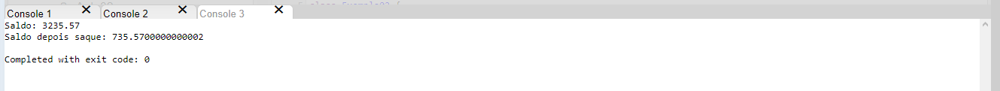
- Porém este método tem um problema. Caso fizermos um novo saque de 1000:
    ```java
    .....
        Conta c1 = new Conta("Andre","22222222",3235.57,10000);
        System.out.println("Saldo: "+c1.getSaldo());
        c1.saca(2500);
        System.out.println("Saldo depois saque: "+c1.getSaldo());
        c1.saca(1000);
        System.out.println("Saldo depois saque: "+c1.getSaldo());
    ```
    - Resultado: 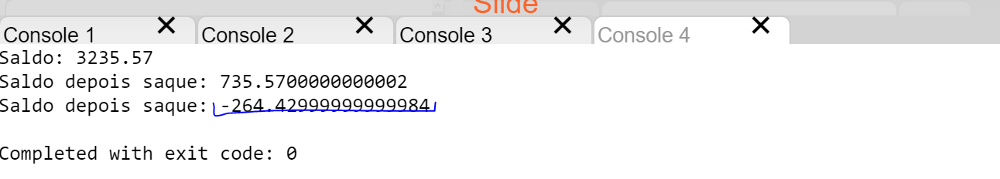. Conta esta com saldo negativo!
- Refatorando o método ``saca()``
    ```java
    public class Conta(....){
    .....
    //método saca()
    public void saca(double valor){
        if(valor > this.saldo){
            System.out.println("Não há saldo disponível para este valor");
            return;
        }
        this.saldo -= valor;
    }
    ....
    }
    ```
    - Executando novamente o código: 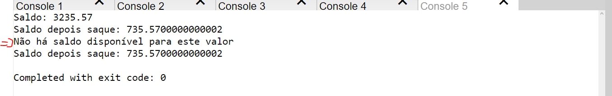
- Vamos ajustar o método ``saca()`` para verificar valor máximo de saque:
    ```java
    public class Conta(....){
    .....
    //método saca()
    public void saca(double valor){
        if(valor> MAX_SAQUE){
            System.out.println("Valor máximo para saque: R$ "+MAX_SAQUE);
            return;
        }
        if(valor > this.saldo){
            System.out.println("Não há saldo disponível para este valor");
            return;
        }
        this.saldo -= valor;
    }
    ....
    }
    ```
- Agora vamos fazer o método para ``deposita(valor)``
```java
  public void deposita(double valor){
	if(valor < 0){
      System.out.println("Valor inválido para depósito!");
      return;
    }
    this.saldo+=valor;
  }
```
- Modifique a classe principal
```java
public static void main(String[] args) {
    Conta c1 = new Conta("Andre","22222222",3235.57,10000);
    System.out.println("Saldo: "+c1.getSaldo());
    c1.deposita(2000);
    System.out.println("Saldo depois deposito: "+c1.getSaldo());
   	c1.deposita(-2000);
  }
```
- Método ``compraCartao(valor)``:
    ```java
    public void compraCartao(double valor){
        if(valor < this.limiteCartao){
            System.out.println("Não há saldo para esta compra!");
            return;
        }
        this.limiteCartao -=valor;
    }
    ```
- Método ``transferePara()``
    ```java
    public void transferePara(Conta contaDestino, double valor){
        if(valor < 0){
            System.out.println("Valor inválido!");
            return;
        }
        if(valor > this.saldo){
            System.out.println("Saldo Insuficiente!");
            return;
        }
        //realiza saque
        this.saca(valor);
        //deposito na conta destino
        contaDestino.deposita(valor);
    }
    ```
- Criar um método ``toString()``
    ```java
    @Override
    public String toString() {
        return "Nome: " + this.nome + "\n"+
                "CPF: " + this.cpf + "\n" +
                "Saldo: "+ this.saldo + "\n"+
                "limiteCartao: "+ this.limiteCartao + "\n";
    }
    ```
- Refatorar a classe ``Exemplo02.java``
```java
public class Exemplo02 {
    public static void main(String[] args) {
        Conta c1 = new Conta("Andre","22222222",3235.57,10000);
        Conta c2 = new Conta("Beatriz","323232",4500,10000);
        
        c1.transferePara(c2, 500);
        System.out.println(c1);
        System.out.println(c2); 
    }
}

```
- Resultado final: 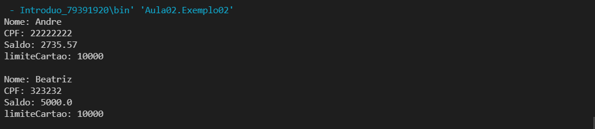


