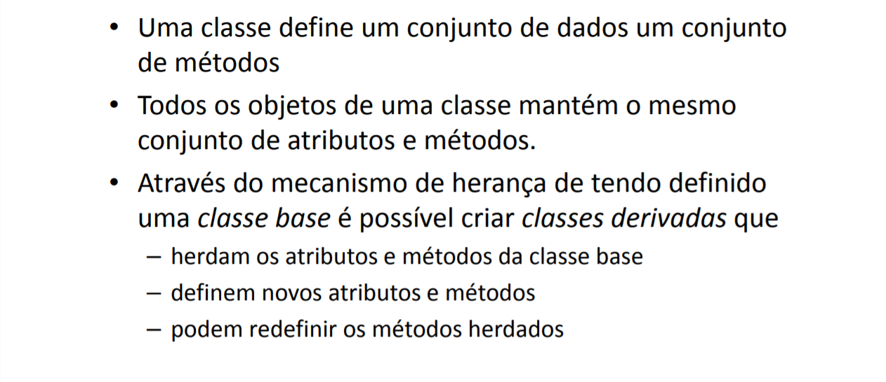
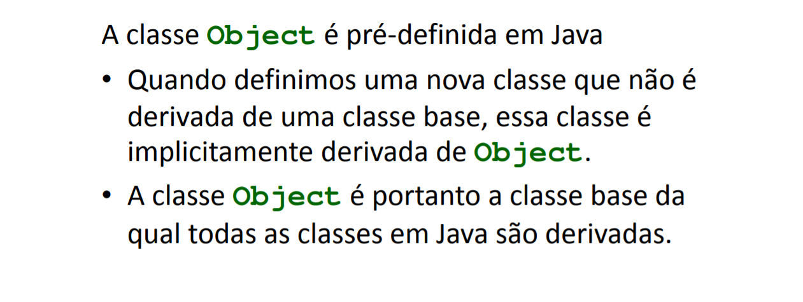
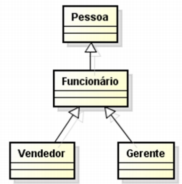
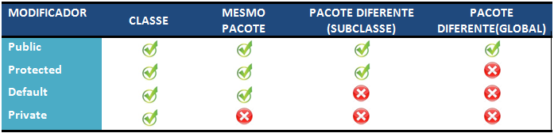
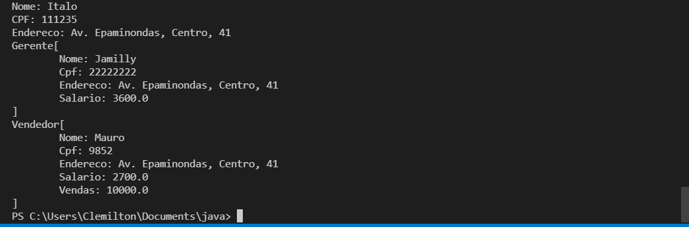
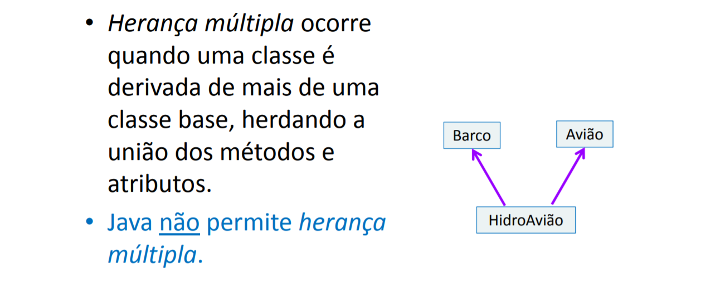
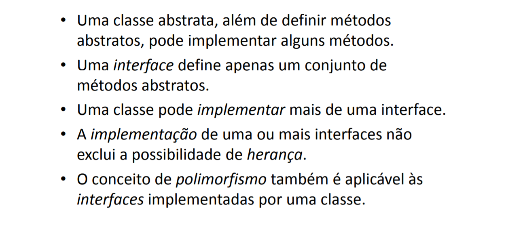
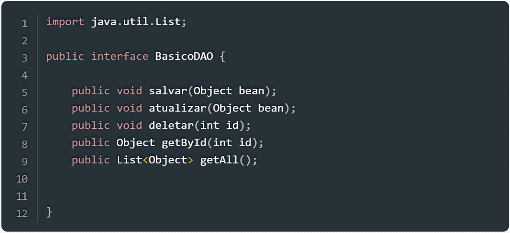
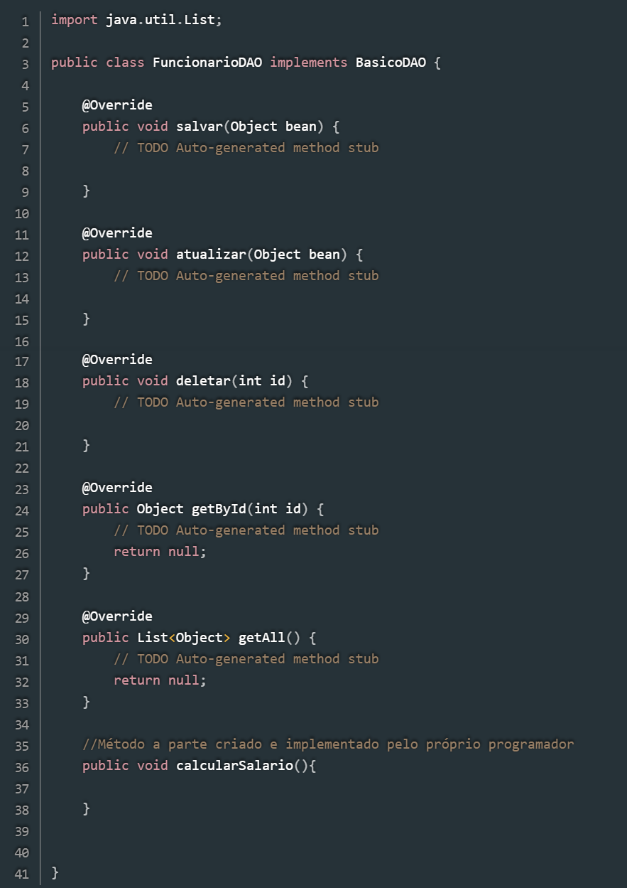
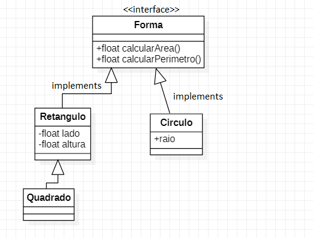

# Classes e Herança


# Classe Object

- Vamos implementar o seguinte modelo:
<center></center>

# 1 - Pessoa.java
```java
package Aula03.classes;

public class Pessoa {
    //ENCAPSULAMENTO
    protected String nome;
    protected String cpf;
    
    //Assinatura: (String)
    public Pessoa(String nome) {
        this.nome = nome;
    }
   //Assinatura: (String, String)
   public Pessoa(String nome, String cpf) {
        this(nome);
        this.cpf = cpf;
     }
   
    @Override
    public String toString(){
        return "Nome: "+this.nome+ "\n"+
                "CPF: "+this.cpf + "\n";
    }
   public String getNome() {
        return nome;
    }
 
    public void setNome(String nome) {
        this.nome = nome;
    }
}
```
## 1.1 Modificadores de Acesso 
### Observe que os atributos da classe estão definidos como `protected`.
```java
public class Pessoa {
    protected String nome;
    protected String cpf;
```
- Isto significa que estes atributos são visíveis em classes filhas de `Pessoa`, ou do mesmo pacote. 
- Observe como se comportam os diferentes modificadores de acesso:



## 1.2 Sobrecarga de construtores
### Observe que foram definidos 2 construtores com assinaturas diferentes:
```java
    ...
    public Pessoa(String nome) {
        this.nome = nome;
     }
   
   public Pessoa(String nome, String cpf) {
        this(nome);
        this.cpf = cpf;
    }
    ...
```
- O primeiro construtor inicializa apenas no atributo `nome`
- O segundo construtor inicializa os atributos `nome` e `cpf`. O comando `this(nome)` chama o primeiro construtor, que inicializa o `nome`.
- Ou seja, a classe Pessoa, pode ser instanciada de duas maneiras.
- Nesta parte, está acontencendo uma **sobrecarga**. A sobrecarga ocorre quando 2 métodos com mesmo nome e assinaturas diferentes estão na mesma classe.

## 1.3 - Método toString() e Getters and Setters
```java
    @Override
    public String toString(){
        return "Nome: "+this.nome+ "\n"+
                "CPF: "+this.cpf + "\n";
    }
   public String getNome() {
        return nome;
    }
 
    public void setNome(String nome) {
        this.nome = nome;
    }
```
## 2. Classe Endereco.java
```java
package Aula03.classes;

public class Endereco {
    private String rua;
    private String bairro;
    private String numero;

    public Endereco(String rua,String bairro, String numero){
        this.rua = rua;
        this.bairro = bairro;
        this.numero = numero;
    }
    @Override
    public String toString(){
        return this.rua + ", "+ this.bairro+", "+this.numero;
    }
}

```
- Acima foi definida a classe Endereço, com atributos rua, bairro e numero.
### 2.1 Método toString() e @Override
```java
    @Override
    public String toString(){
        return this.rua + ", "+ this.bairro+", "+this.numero;
    }
```

- `toString()` é um método da classe Object. Como falado em aula, todas as classes Java herdam(são filhas) de Object. Este método tem a função de transformar um objeto em uma String. Ele pode ser usado para impressão do objeto.
- Nesta parte está ocorrendo uma **sobreescrita**. A sobrescrita acontece quando uma classe filha, implementa um método da classe pai.
- No caso, a classe `Estudante`, está implementando o método `toString()` que faz parte da classe `Object` 
- O comando `@Override` é uma anotação (annotations). As anotações servem para dar uma maior semântica no código. `@Override` significa que estamos sobrescrevendo um método da classe pai.
- As anotações são muito utilizadas em Frameworks de Persistência, Bibliotecas android, Testes Unitários, entre outros.
- Leitura complementar: https://cursos.alura.com.br/forum/topico-sobrescrita-e-sobrecarga-de-metodos-qual-a-diferenca-e-para-o-que-servem-73090
- Leitura complementar: https://www.devmedia.com.br/entendendo-anotacoes-em-java/26772
# 3 - Refactoring Pessoa.java
## Adicionar atributo
```java
    //Pessoa.java
    ...
    protected String nome;
    protected String cpf;
->  protected Endereco endereco;
    ...
```
- Adicionamos um atributo da classe `Endereço` em `Pessoa`
- Isto é uma implementação de associação entre duas classes(Diagrama de Classes UML)
- Leitura complementar: https://www.devmedia.com.br/implementando-uml-em-java/4042


## Pessoa.toString()
- Modificando método ``toString()``
```java
    @Override
    public String toString(){
        return "Nome: "+ this.nome +"\n"+
                "CPF: "+this.cpf+"\n"+
                "Endereço:" + this.endereco;
    }
```
- O código fica mais organizado desta maneira, pois deixamos a responsabilidade de impressao para a classe que contém o `main()`.
- Observe que utilizamos o método toString do do atributo endereço: `this.endereco.toString()`

## 3.4 - Adicionando construtor de 3 parâmetros
```java
    public Pessoa(String nome, String cpf) {
        this(nome);
        this.cpf = cpf;
    }
->  public Pessoa(String nome, String cpf, Endereco endereco){
        //Chamando construtor de 2 parâmetros
        this(nome,cpf);
        this.endereco = endereco;
    }
```
<p align="center"><b>Pessoa.java</b></p>

- Criamos mais um construtor, agora com 3 parâmetros, que recebe o Endereço
- Observe que chamamos o construtor de 2 parâmetros em: `this(nome,cpf)`
# 4 - Classe Main - Exemplo05.java
## Agora vamos implementar um classe que utiliza `Pessoa` e `Endereco`.
```java
package Aula03;
import Aula03.classes.*;
class Exemplo05{
    public static void main(String[] args) {
        Endereco e1 = new Endereco("Av. Buriti", "Distrito Industrial","584-B");
        Pessoa p1 = new Pessoa("João", "11111111", e1); 
        System.out.println(p1);
    }
}   
```
- Instanciamos um endereço e uma pessoa.
- Observe que não precisamos chamar o método toString() para impressão do objeto.

# 5  - Herança
## <li>Herança é uma forma de reutilização de software, onde uma nova classe é criada absorvendo dados de uma classe existente.</li>
## <li>A classe nova é chamada de SUBCLASSE, já a classe antiga, que é absorvida pela nova, é chamada de SUPERCLASSE </li>
## <li> A herança pode se dar em vários níveis, formando uma hierarquia</li>
## <li>A classe filha terá todos os atributos e métodos da classe pai </li>
## <li>Vamos implementar o seguinte modelo: </li>

<center></center>

# 6 - Adicionando a classe Funcionário
```java
package Aula03.classes;

public class Funcionario extends Pessoa {
    protected double salario;

    public Funcionario(String nome,String cpf, Endereco endereco, double salario){
        super(nome,cpf,endereco);
        this.salario = salario;
    }
    public String toString(){
        String func = super.toString();
        func += "\nSalario: " + this.salario;
        return func;
    }
    public double getSalario(){
        return salario;
    }
    public void setSalario(double salario){
        this.salario = salario;
    }
}
```
## 6.1 - Palavra chave Extends

```java
...
public class Funcionario extends Pessoa {
    protected double salario;
    ...
```
- O trecho de codigo acima faz uma relação de herança entre Pessoa e Funcionário. A palavra chave `extends` realiza a herança;
- Funcionário é subclasse de Pessoa. Logo `Funcionário` tem todos os atributos e métodos da classe `Pessoa`;
- O atributo salario foi adicionado como `protected`, ou seja suas sub-classes também tem acesso a ele;

## 6.2 - Método super()

```java
    public Funcionario(String nome,String cpf, Endereco endereco, double salario){
        super(nome,cpf,endereco);
        this.salario = salario;
    }
```
- Acima temos os construtor da classe `Funcionário`.
- O método super(), faz referência ao construtor da classe pai `Pessoa`.
- Ou seja, os atributos da classe pai são inicializados.
- Após isso, o atributo `salario` também é inicializado


## 6.3 - Método toString()
```java
    public String toString(){
        String func = super.toString();
        func += "\nSalario: " + this.salario;
        return func;
    }
```
- Acima temos a implementação do método toString(), da classe Funcionário.
- Observe que o comando `super.toString()`, chama o método da classe pai (`Pessoa`)

## 6.4 - getter and setter
```java
    public double getSalario(){
        return salario;
    }
    public void setSalario(double salario){
        this.salario = salario;
    }
```

# 7 - Refactoring Exemplo 05
```java
package Aula03;
import Aula03.classes.*;
class Exemplo05{
    public static void main(String[] args) {
        Endereco e1 = new Endereco("Av. Buriti", "Distrito Industrial","584-B");
        Pessoa p1 = new Pessoa("João", "11111111", e1); 
        
        System.out.println(p1);

        Endereco e2 = new Endereco("Av. Noel Nutels","Cidade Nova","1110");
        Funcionario f = new Funcionario("Jamilly", "22222222",e2, 3000);
        System.out.println(f);
    }
}   
```

- Um funcionário foi instanciado e mostrado os seus valores.
- Observe na saída, que os atributos de pessoa também são iniciados.
# Classes abstratas
- As classes abstratas servem como “modelo” para outras classes. Informam como as classes devem se comportar. Definem atributos e métodos.
- Classes abstratas são classes que NÃO PODEM SER INSTACIADAS.
- Classes derivadas DEVEM implementar os métodos abstratos.
- Identificamos uma classe como abstrata pelo modificador `abstract`.
## Exemplo
<center></center>

- Tanto o vendedor, quanto o gerente, são subclasses de funcionários. Porém a forma de calculo do salário de cada um é diferente.
- Neste caso a classe Funcionário pode ser abstrata, e as classes Vendedor e Gerente podem implementar essas diferentes formas de calcular o salário
- Caso haja outros tipos de funcionários, com calculos diferentes, a classe `Funcionario` servirá de base para outras.
- LEMBRE-SE: Classes abstratas NÃO podem ser instanciadas.

## Classe Funcionario.java
```java
public abstract class Funcionario extends Pessoa {
    protected double salario;

    public abstract double calculaSalario();
```
- Alteramos a classe Funcionario para abstrata: `public abstract class Funcionario ...`
- Adicionamos um método calculaSalario() abstrato. Agora TODA classe que estender de `Funcionário`, deverá sobrescrever o método `calculaSalario`.

# Classe vendedor
```java
package Aula03.classes;

public class Vendedor extends Funcionario {
    private double totalVendas;

    public Vendedor(String nome, String cpf,Endereco endereco, 
                    double salario, double totalVendas){
        super(nome,cpf,endereco,salario);
        this.totalVendas =totalVendas;
    }

    
    @Override
    public String toString(){
        String func = super.toString();
        return "Vendedor[" + func + "\n" +
                "Salario: "+this.calculaSalario()+"\n"+
                "Vendas: "+this.totalVendas+"]";

    }
    @Override
    public double calculaSalario(){
        return salario + (totalVendas*0.02);
    }
    public double getTotalVendas() {
        return totalVendas;
    }

    public void setTotalVendas(double totalVendas) {
        this.totalVendas = totalVendas;
    }
}

```
- Observe que a classe `Vendedor` estende de `Funcionario`
- Então, somos obrigados a implementar o método ``calculaSalario()``
- Observe que também implementamos o método `toString()`, utilizando o método `calculaSalario()`

# Classe gerente
```java
package Aula03.classes;

public class Gerente extends Funcionario {
    
    public Gerente(String nome, String cpf,Endereco endereco, double salario){
        super(nome,cpf,endereco,salario);
    }

    @Override
    public double calculaSalario() {
        return salario + (salario * 0.2);
    }

    @Override
    public String toString(){
        return "Gerente[\n\tNome: "+ this.nome + "\n"+
                "\tCpf: "+this.cpf + "\n"+
                "\tEndereco: "+ this.endereco + "\n"+
                "\tSalario: "+this.calculaSalario()+"\n]";
    }
}
```
- A classe `Gerente` também estende de funcionário.
- Observe que a implementação do método `calculaSalario()` é diferente da classe `Vendedor`.
# Classe Main
```java
package Aula03;

import Aula03.classes.*;
public class Main {
    public static void main(String[] args) {
        Endereco e1 = new Endereco("Av. Epaminondas", "Centro", "41");
        Pessoa p = new Pessoa(
            "Italo",
            "111235",
            e1
        );
        System.out.println(p);

        Funcionario g = new Gerente("Jamilly", "22222222",e1, 3000);
        Funcionario v = new Vendedor("Mauro","9852",e1,2500,10000);

        System.out.println(g);
        System.out.println(v);
    }  
}
```
- Obtemos como saída: 
- Vamos modificar a classe ``Gerente`` para ter uma lista de vendedores e dois construtores para inicializar a lista.
```java
import java.util.ArrayList;

public class Gerente extends Funcionario {
    //Atributo listaVendedor
    private ArrayList<Vendedor> listaVendedor;

    public Gerente(String nome, String cpf,Endereco endereco,  double salario){
        super(nome,cpf,endereco,salario);
        //instanciando um ArrayList vazio
        this.listaVendedor = new ArrayList<>();
    }

    public Gerente(String nome, String cpf, 
                    Endereco endereco, double salario,ArrayList<Vendedor> listaVendedor){
        this(nome,cpf,endereco,salario);
        //inicializando com uma lista preenchida
        this.listaVendedor = listaVendedor;
    }
....
```
- Método para adicionar um Vendedor na lista:
```java
    public void adicionarVendedor(Vendedor vendedor){
        listaVendedor.add(vendedor);
    }
```
- Refatorando o método ``toString()`` para imprimir a lista de vendedores do ``Gerente``:
```java
public String strListaVendedor(){
        String result ="";
        for(int i=0; i < listaVendedor.size(); i++){
            Vendedor v = listaVendedor.get(i);
            result+="\nVendedor "+i+": "+v.getNome();
        }
        return result;
    }

    @Override
    public String toString(){
        String func = super.toString(); 
        return "Gerente[\n"+func+"\n"+
                "Salario: "+this.calculaSalario()+
                this.strListaVendedor()+
                "\n]";
    }

``` 
- Modificar a classe ``Main``
```java
package Aula03;

import Aula03.classes.*;
import java.util.ArrayList;
public class Main {
    public static void main(String[] args) {
        Endereco e1 = new Endereco("Av. Epaminondas", "Centro", "41");
        //Criando vendedores
        Vendedor v1 = new Vendedor("Mauro","9852",e1,2500,10000);
        Vendedor v2 = new Vendedor("Evelin","42163",e1,2500,8253.24);
        Vendedor v3 = new Vendedor("Lara","83822",e1,2500,12243.23);
        Vendedor v4 = new Vendedor("Mauricio","138418",e1,2500,9321.55);

        
        ArrayList<Vendedor> l  = new ArrayList<>();
        l.add(v1);
        l.add(v2);

        Gerente g1 = new Gerente("Jamilly", "22222222",e1, 3000,l);
        Gerente g2 = new Gerente("Alisson","7893432",e1,3000);
        g2.adicionarVendedor(v3);
        g2.adicionarVendedor(v4);

        

        System.out.println("GERENTES: ");
        System.out.println(g1);
        System.out.println(g2);
    }  
}
```
- Agora vamos implementar o método ``calcularSalario()`` conforme o salario dos vendedores:


# Herança Múltipla

# Interfaces

# Exemplo Interfaces
- A Interface é muito utilizada em grandes projetos para obrigar o programador a seguir o padrão do projeto
- Ex: 
- Temos uma Interface BasicoDAO que dirá aos programadores do nosso projeto o que suas classes DAO devem ter.
- Para realizar o CRUD de Funcionários, ele implementa a interface acima e ainda adiciona métodos a parte.


# Exemplo Interface
- 
- Implemente interface de nome Forma onde são declarados dois métodos abstractos:
    - float calcularArea();
    - float calcularPerimetro();
- A classe ``Retangulo`` deve implementar os métodos *calcularArea()* e *calcularPerimetro()*. Deve ter atributo largura e altura do tipo float.
- A classe ``Circulo`` é uma subclasse de Forma e deve implementar os métodos *calcularArea()* e calcular perímetro. Adicione o raio como atributo.
-  classe ``Quadrado`` é uma subclasse de ``Retangulo``. Não tem nenhum atributo específico, porém a largura e a altura tem o mesmo tamanho.
- Todas as classes devem implementar um construtor.
- Todas as classes deve implementar um método toString(), informando o tipo da Forma, a área e o perímetro.
- Crie um arquivo Exercicio03.java, onde você irá declarar um array de Formas, do tamanho 03.
    - 1º - Círculo(Raio: 10)
    - 2º - Retângulo(Lado: 20, Altura:30);
    - 3º - Quadrado(Lado: 20)
- Faça um laço de repetição que percorra o array e imprima cada elemento

## Forma.java
    ```java
    package Aula03.classes;

    public interface Forma {
        float calcularArea();

        float calcularPerimetro();
    }
    ```
    - Criamos a interface forma com dois métodos:
        - ``calcularArea()``
        - ``calcularPerimetro()``
## Retangulo.java
    ```java
    package Aula03.classes;

    public class Retangulo implements Forma {
        private float largura;
        private float altura;

        public Retangulo(float largura, float altura){
            this.largura = largura;
            this.altura = altura;
        };

        public float calcularArea(){
            return largura*altura;
        }

        public float calcularPerimetro(){
            return 2*(largura+altura);
        }

        @Override
        public String toString() {
            return "RETANGULO [\n"+
                    "AREA: "+ this.calcularArea() + "\n"+
                    "PERIMETRO: "+ this.calcularPerimetro() + "\n" + 
                    "]";
        }
    }
    ```
    - Criamos a classe retangulo com os métodos implementados da interface.
## Circulo.java
```java
package Aula03.classes;
import java.lang.Math;
public class Circulo implements Forma {
       private float raio;

    public Circulo(float raio){
        this.raio = raio;
    }
    public float calcularArea(){
        return (float)Math.PI*raio*raio;
    }

    public float calcularPerimetro(){
        return 2*(float)Math.PI*raio;
    }

    @Override
    public String toString() {
        // TODO Auto-generated method stub
        return "CIRCULO [\n"+
                "AREA: "+ this.calcularArea() + "\n"+
                "PERIMETRO: "+ this.calcularPerimetro() + "\n" + 
                "]";
    }
    
}
```
## Quadrado.java
```java
package Aula03.classes;

public class Quadrado extends Retangulo{
    private float lado;

    public Quadrado(float lado) {
        super(lado, lado);
        //TODO Auto-generated constructor stub
    }

    @Override
    public String toString() {
        return "QUADRADO [\n"+
                "AREA: "+ this.calcularArea() + "\n"+
                "PERIMETRO: "+ this.calcularPerimetro() + "\n" + 
                "]";
    }
}
```
## Main2.java
```java
package Aula03;
import Aula03.classes.*;
public class Main2 {
    public static void main(String[] args) {
        Circulo c = new Circulo(10);
        Retangulo r = new Retangulo(20,30);
        Quadrado q = new Quadrado(20);

        Forma[] formas = {c,q,r};

        for(int i = 0 ; i<formas.length ; i++){
            System.out.println(formas[i]);
        }
    }
    
}
```

