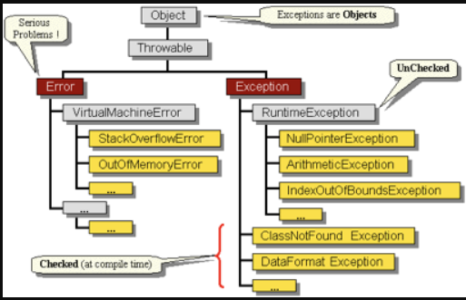

# Tratamento de Exceções em Java

## Exceções em Java
- A linguagem Java possui um mecanismo para o tratamento de **erros** que possam ocorrer **em tempo de execução** do programa. Ao tratar esses erros de forma adequada evitamos a interrupção do programa como um tudo.
- As exceções ocorrem quando algo imprevisto acontece, elas podem ser provenientes de **erros de lógica** ou **acesso a recursos** que talvez não estejam disponíveis. 
- Alguns possíveis erros de lógica para ocorrer uma exceção são:
    - Tentar manipular um objeto que está com o valor nulo.(NullPointerException)
    - Dividir um número por zero.
    - Tentar manipular um tipo de dado como se fosse outro.
    - Tentar utilizar um método ou classe não existentes.
    -  Exemplo da exceção NullPointerException

- Alguns motivos externos para exceções são:
    - Tentar abrir um arquivo que não existe.
    - Tentar fazer uma consulta a um banco de dados que não está disponível
    - Tentar escrever algo em um arquivo sobre o qual não se tem permissão de escrita.
    - Tentar conectar em servidor inexistente.
- As exceções são representadas pela classe ``java.lang.Exception``, logo todas as exceções que ocorram ao longo da execução do seu programa podem ser tratadas como objetos do tipo Exception.

## Bloco try/catch
- Como a exceção é lançada por toda a cadeia de classes do sistema, a qualquer momento é possível se “pegar” essa exceção e dar a ela o tratamento adequado.
- Para realizar o tratamento de exceções utilizamos o bloco ``try/catch`` como segue o exemplo abaixo
    ```java
    public class Exemplo01 {
        public static void main(String[] args) {
            try {
            /* Trecho de código no qual uma
            * exceção pode acontecer.
            */
            } catch (Exception e) {
            /* Trecho de código no qual uma
            * exceção do tipo "Exception" será tratada.
            */
            }
        }
    }
    ```
    - No código acima, o bloco ``try`` é onde se espera que uma exceção irá ocorrer. O bloco ``catch`` é executado caso a exceção ocorra.
    - Uma vez declarado um bloco try, a declaração do bloco catch torna-se obrigatória.
    - Dentro do bloco ``catch`` temos um objeto do tipo Exception, pois todas as exceções do Java são classes filhas de Exception.
    - 
- Continuando o Exemplo01:
    ```java
    import java.util.Scanner;
    class Exemplo01 {
        public static void main(String[] args) {
            Scanner s = new Scanner(System.in);
            try {
                /* Trecho de código no qual uma exceção pode acontecer. */
                System.out.print("Digite um valor inteiro..:");
                int numero1 = s.nextInt();
                System.out.print("Digite um valor inteiro..:");
                int numero2 = s.nextInt();
                System.out.println(numero1+ " + " + numero2 + " = " + (numero1+numero2));
            } catch (Exception e) {
            /* Trecho de código no qual uma exceção do tipo "Exception" será tratada. */
                System.out.println("ERRO - Valor digitado nao e um numero inteiro!");
                e.printStackTrace();
            }
            
            System.out.println("Execução após exceção!");
        }
    }
    ```
    - No código acima, fazemos a leitura de dois números inteiros. Caso não seja digitado um número a exceção é lançada (bloco ``catch``).
    - Uma vez que uma exceção foi tratada por um bloco catch, a execução do programa segue normalmente.
    - Execução sem erro: 
    - Execução com exceção: 

# Palavra-chave throw
- Também é possível que você próprio envie uma exceção em alguma situação especifica, como em uma situação de login em que o usuário digita incorretamente sua senha.
- Para realizarmos tal tarefa é necessária a utilização da palavra-chave ``throw`` da seguinte maneira:
    ```java
    import java.util.Scanner;

    class Exemplo02 {
    
        public static final String SENHASECRETA = "123456";
        
        public static void main(String[] args) {
            Scanner s = new Scanner(System.in);
            try{
                System.out.print("Digite a senha: ");
                String senha = s.nextLine();
                if(!senha.equals(SENHASECRETA)){
                    throw new Exception("Senha invalida!");
                }
                System.out.println("Senha correta!!\nBem vindo!");
            }catch(Exception e){
                e.printStackTrace();

            }
        }
    }
    ```
    - No exemplo acima, caso a seja digitado uma senha incorreta, uma exceção é lançada pelo comando ``throw``.
    - Observe também que a palavra reservada ``new`` foi utilizada, visto que a exceção é um novo objeto que deve ser criado na memória. Isso se faz necessário para que a exceção possa ser lançada por toda a pilha de execução até que seja devidamente tratada ou acarrete no término da aplicação.
- Alguns métodos importantes da classe ``Exception``:
    - ``printStackTrace()``: Imprime em tela a pilha de execução. Muito comum para auxiliar no diagnóstico de erros
    - ``getMessage()``: Retorna uma String com a mensagem contida na exceção.
    - ``getClass()``: Retorna uma String com o nome complete da classe da exceção.
## Bloco Finally
- A palavra-chave ``finally`` representa um trecho de código que será sempre executado, independentemente se uma exceção ocorrer. Por exemplo:
    ```java
    import java.util.Scanner;

    class Exemplo02 {
    
        public static final String SENHASECRETA = "123456";
        
        public static void main(String[] args) {
            Scanner s = new Scanner(System.in);
            try{
                System.out.print("Digite a senha: ");
                String senha = s.nextLine();
                if(!senha.equals(SENHASECRETA)){
                    throw new Exception("Senha invalida!");
                }
                System.out.println("Senha correta!!\nBem vindo!");
            }catch(Exception e){
                e.printStackTrace();

            }finally{
                System.out.println("Bloco finally");
            }
        }
    }
    ```
    - No exemplo acima, independente se a exceção ocorra ou não o bloco ``finally`` é executado. Este bloco é muito utilizado quando queremos liberar algum recurso, como: uma conexão com o banco de dados, um arquivo de dados, etc.
# Palavra chave throws
- Imagine uma situação em que não é desejado que uma exceção seja tratada na própria classe ou método, mas sim em outro que venha lhe chamar. 
- Para isso,  basta utilizar a palavra chave ``throws`` no final da assinatura do método.
- Quando utilizamos o throws precisamos também informar qual ou quais exceções podem ser lançadas.
    ```java
    import java.util.Scanner;

    class Exemplo03 {
    public static void main(String[] args) {
        Scanner s = new Scanner(System.in);
        Exemplo03 e = new Exemplo03();
        
        System.out.print("Digite o valor do dividendo: ");
        double dividendo = s.nextDouble();

        System.out.print("Digite o valor do divisor: ");
        double divisor = s.nextDouble();
        try {
            double resultado = e.dividir(dividendo, divisor);

            System.out.println("O resultado da divisao eh: " + resultado);
        } catch (Exception ex) {
            System.out.println(ex.getMessage());
        }
    }

    public double dividir(double dividendo, double divisor) throws Exception {
        if(divisor == 0) {
        throw new Exception("Nao e permitido fazer uma divisao por zero!");
        }

        return dividendo / divisor;
    }
    }
    ```
    - No código acima o método ``dividir()`` lança uma exceção caso o divisor seja igual a zero. Observe que não tratamos a exceção no método, jogando a responsabilidade de tratar a exceção para quem for chamar o método ``dividir()``

# Hierarquia das exceptions
A princípio, Java possui diversos tipos específicos de exceção, cada um deles diretamente relacionado a uma operação específica, por este motivo para que uma classe seja considerada uma exceção é imprescindível que ela de alguma forma seja filha de ``java.lang.Exception``. As exceções são dividas em:
- Checked Exceptions
- Unchecked Exceptions
- No quadro abaixo, temos um exemplo da hierarquia de algumas subclasses de Exception: 

# Checked Exceptions
- As checked exceptions, são exceções já previstas pelo compilador. 
- Usualmente são geradas pela palavra chave ``throw``
- Como ela é prevista já em tempo de compilação, se faz necessária a utilização do bloco ``try/catch`` ou da palavra chave ``throws``.
- A princípio, todas as classes filhas de Exception são do tipo checked, exceto pelas subclasses de ``java.lang.RuntimeException``

# Unchecked Exceptions
- O programador não é obrigado a tratar a exceção. Não são checadas no tempo de compilação.
- São subclasses de RuntimeException, e geralmente são implementadas usando ArithmeticException, NullPointerException, ou IllegalStateException;

# Exercício 03:
1. Explique o bloco de Tratamento de Exceções (try...catch...finally...)
2. Explique a forma de lançamento de uma Exceção (throw new...).
3. Explique o funcionamento da Propagação de Exceções (throws).
4. Considere o código abaixo:

    ```java
    class Exercicio03 {
    public static void main(String[] args) {
        
        String[] a = {"ABC","123","0",""};
        for(int i=0; i< 4 ; i++){
        try{
            String s = a[i];
            System.out.println("\t s: "+ s);
            int n = Integer.parseInt(s);
            System.out.println("\t m: "+n);
            int m = 1234/n;
            System.out.println("\t m: "+m);
        }catch(NumberFormatException e){
            System.err.println(e);
        }catch(ArrayIndexOutOfBoundsException e){
            System.err.println(e);
        }catch(ArithmeticException e){
            System.err.println(e);
        }finally{
            System.out.println("\t i: "+i);
        }
        }
        
    }
    }
    ```
    - Execute o programa acima e explique as exceções e quando elas são executadas
# Referências
- https://www.devmedia.com.br/tratando-excecoes-em-java/25514
- http://www.universidadejava.com.br/java/java-excecoes/