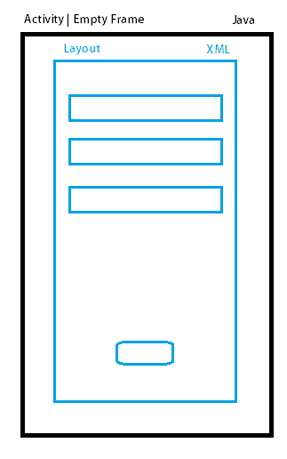
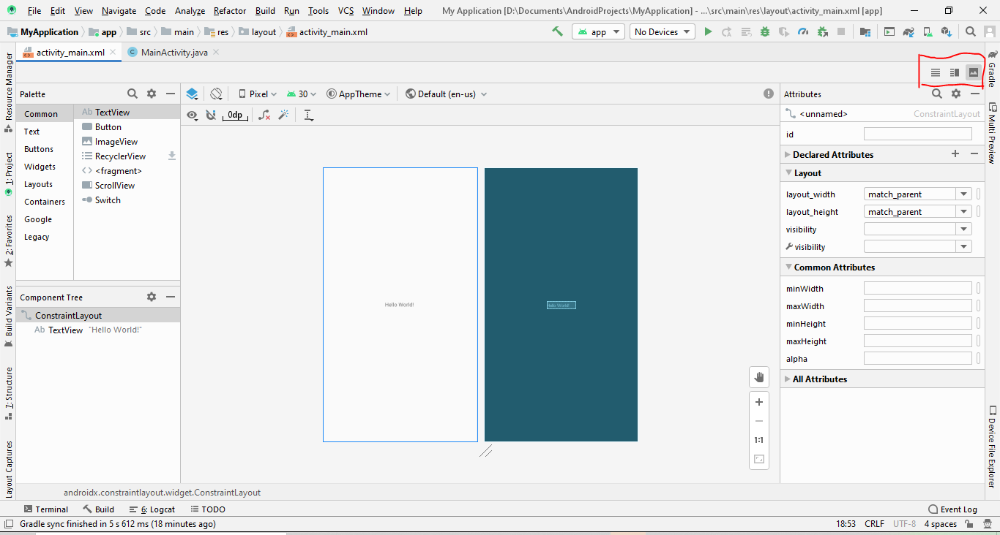

# Aula 01 - Android - 30/10/2020
## O que é android?
- É um S.O. para dispositivos móveis desenvolvido pela Google
- Baseado no kernel do Linux
- Utilizado em celulares, tablets, TVs, Relógios...
- Opensource(customizável)
<center> </center>
<center>Representação de um S.O </center>

# Arquitetura da Plataforma
-  O Android é uma pilha de software erguida sobre uma versão customizada do Kernel do Linux. 
- O diagrama a seguir mostra a maioria dos componentes da plataforma Android
<center> </center>

## Kernel do Linux
- O Kernel é responsável por executar tarefas de baixo nível, mais próximas do hardware do dispositivo, como o gerenciamento de memória.
- Ao utilizar o linux, os fabricantes de smartphones podem criar drivers para seus hardwares a partir de um sistema conhecido, bem documentado e independente.

## Camada de abstração de hardware (HAL)
- Fornece interfaces padrão que expõem as capacidades de hardware do dispositivo para a estrutura da Java API de maior nível.
- É através da HAL que acessamos o hardware do dispositivo, como sua câmera, bluetooth, etc.
- Quando uma Framework API faz uma chamada para acessar o hardware do dispositivo, o sistema Android carrega o módulo da biblioteca para este componente de hardware.
- Acima da HAL, temos uma divisão entre os componentes que permitem a **execução de aplicativos** e **serviços do sistema** e as suas bibliotecas nativas.

## ART - Android Run Time
- É um ambiente de tempo de execução gerenciado no qual são executados os aplicativos e alguns serviços do sistema(Máquina Virtual)
- Substituiu o Dalvik V.M(Anterior ao android 5.0)
- Ambos executam um bytecode otimizado para baixo consumo de memória chamado Dalvik Executable(.dex)
<center> </center>

- **Principais funções:**
    - Compilação de arquivos DEX em executáveis criados para o dispositivo durante a instalação do aplicativo.
    - Garbage Collector otimizado para funcionar com pouco consumo, fragmentação de memória e processamento paralelo
    -  Facilitar a depuração, geração de relatórios de erro e diagnósticos.

## Bibliotecas nativas  C/C++
- Vários componentes e serviços principais do sistema Android, como ART e HAL, são implementados por código nativo que exige bibliotecas nativas programadas em C e C++
- A plataforma Android fornece as Java Framework APIs para expor a funcionalidade de algumas dessas bibliotecas nativas aos aplicativos. 
- Por exemplo, é possível acessar OpenGL ES pela Java OpenGL API da estrutura do Android para adicionar a capacidade de desenhar e manipular gráficos 2D e 3D no seu aplicativo.

## JAVA API
- Contém os componentes que precisamos para criar aplicativos utilizando serviços e acessando recursos do sistema operacional.
- Fornece recursos como:
    - Criação de views
    - Gerenciamento de recursos
    - Notificações e Alertas de Usuários
    - Compartilhamento de dados
    - Navigação de Aplicativos(Activities)

## Aplicativos do sistema
-  Conjunto de aplicativos principais para e-mail, envio de SMS, calendários, navegador de internet, contatos etc

# Android Studio
- O Android Studio é o ambiente de desenvolvimento integrado (IDE, na sigla em inglês) oficial para o desenvolvimento de apps para Android
- Link para download(Android 3.6.3):https://drive.google.com/file/d/1a3PwZ5UJRmGsIHIuY56Fn0D05bu_kYu1/view?usp=sharing
- Vamos ver os principais utilitários na IDE:
    - Android SDK Manager
    - AVD Manager
    - Gradle(Ver após iniciar novo projeto)

## Iniciando novo projeto:
1. Start new Android Studio Project
<center> </center>

2. Empty Activity
<center> </center>

3. Escolha nome da aplicação, pacote, local no computador, linguagem, SDK e clique em finish
<center> </center>

## Principais Arquivos e pastas

<center> </center>

- **manifests/AndroidManifest.xml**
    - descreve informações essenciais sobre o aplicativo para as ferramentas de compilação do Android, para o sistema operacional Android e para o Google Play.
    - Contém o nome do pacote do aplicativo
    - Configurações de Activities, broadcast/content providers.
    - Permissões que o app precisa ter para funcionar corretamente

- **java/**
    - Contém todo codigo java, desde atividades(activities), até classes model de acesso a banco de dados, por exemplo.
    - Observe que há 3 pastas dentro de /java. As pastas que estão marcadas como ``androidTest`` e ``test`` são para teste de software e não serão usadas no curso.
- **res/**
    - Contém a interface gráfica do aplicativo do aplicativo: 
        - 
        - drawable: Contém items desenháveis em XML: Botões, ícones
        - layout: Layouts de Telas, Layouts de Componentes
        - mipmap: imagens em diferentes resoluções
        - values: Valores que podem ser reaproveitados: Cores, strings, estilos
    - Feito em XML
## Relação entre Activity(JAVA) e Layouts(XML)
<center> </center>

- Activity é feita em Java, e nela se programa o comportamento da tela e dos componentes.
- Layouts é feito em XML, e nele se programa o design de cada activity, ou componente customizado.

## MainActivity.java - Estrutura inicial
```java
package com.clemiltonvp.myapplication;

import androidx.appcompat.app.AppCompatActivity;

import android.os.Bundle;
//define uma Activity -> Tela Android
public class MainActivity extends AppCompatActivity {
    //onCreate(): Método executado ao iniciar app
    @Override
    protected void onCreate(Bundle savedInstanceState) {
        super.onCreate(savedInstanceState);
        //definindo layout da activity
        setContentView(R.layout.activity_main);

        
    }
}
```
### Principais partes do código:
- `public class MainActivity extends AppCompatActivity{`: Definindo a classe `MainActivity` como uma Activity
- `protected void onCreate(Bundle savedInstanceState)`: Método onCreate(). Este método é executado quando o aplicativo é iniciado. Faz parte do ciclo de vida de um activity. Parecido com o método `main()`.
    - O parâmetro ``savedInstanceState`` guarda o estado atual da Activity. Quando um app é minimizado, ele fica em segundo plano. Ao voltar para o app, este parâmetro contém as informações do estado anterior do app.
- `setContentView(R.layout.activity_main)`: Ligação entre Activity e Layouts
# Primeiro Layout XML(activity_main.xml)
- Ao abrir este arquivo obtemos a seguinte tela:
    - 
    - O Layout pode ser feito de duas maneiras. Pelo modo Design(mostrado acima), ou pelo código XML.
    - No canto superior direito, temos as opções a serem selecionadas: ``Code``, ``Split`` e ``Design``
    - Selecionando a opção ``Split`` podemos ver os dois modos simultaneamente
- Código do Layout: 
    - 
    - Usando XML, é possível construir layouts de UI e os elementos de tela intrínsecos, do mesmo modo que se cria páginas Web em HTML - com uma série de elementos aninhados.
    - Cada arquivo de layout deve conter exatamente um elemento raiz (Geralmente um Layout). Com o elemento raiz definido, é possível adicionar objetos ou widgets de layout extras como elementos filho para construir a interface.
    - *1 - ConstraintLayout*: Define um ConstraintLayout como elemento raiz. Veremos mais sobre esse layout mais na frente.
    - *2 - xmlns:android*: Define um namespace android. Os atributos XML do android estão em diferentes namespace. O namespace android, tem atributos de largura, altura, texto.
    - *3 - layout_width e layout_height*: Definem a largura e altura do do componente. Neste caso o ``ConstraintLayout`` Podem ter como valores:
        - px, in,mm (diferentes dimensões em Android)
        - ``wrap_content`` e ``match_parent``
    - *4 - tools:context*: Define em qual Activity o layout será aplicado.
    - *5 - layout_width e layout_height*: Largura e altura do ``TextView``
    - *6 - android:text*: Define o texto que aparece no ``TextView``
    - *7 - layout_constraints*: Definem como o componente irá se posicionar na tela. Atributos utilizados somente com o ``ConstraintLayout``
## Outros arquivos .XML
- ``colors.xml``: Armazena as cores do app
    ```xml
    <?xml version="1.0" encoding="utf-8"?>
    <resources>
        <color name="colorPrimary">#6200EE</color>
        <color name="colorPrimaryDark">#3700B3</color>
        <color name="colorAccent">#03DAC5</color>
    </resources>
    ```
    - Arquivo que define as cores utilizadas no aplicativo.
- ``strings.xml``:
    ```xml
    <resources>
        <string name="app_name">My Application</string>
    </resources>
    ```
    - Arquivo que determina strings utilizadas no app. 
    - Útil para reuso de SW e internacionalização.
- ``styles.xml``:
    ```xml
    <resources>
        <!-- Base application theme. -->
        <style name="AppTheme" parent="Theme.AppCompat.Light.DarkActionBar">
            <!-- Customize your theme here. -->
            <item name="colorPrimary">@color/colorPrimary</item>
            <item name="colorPrimaryDark">@color/colorPrimaryDark</item>
            <item name="colorAccent">@color/colorAccent</item>
        </style>
    </resources>
    ```
    - Define diferentes temas do aplicativo. No exemplo acima, estamos as cores da barra superior
# Gradle
- O Gradle é um sistema avançado de automatização de builds. Ele que transforma o código fonte em um arquivo .apk pronta para ser executado pelo celular.
- É possível relaizar o build de um aplicativo somente com a linha de comando, porém o processo é complexo. O gradle automatiza o processo.
- Neste curso vamos configurar com frequência esses dois scripts do gradle: 
    - build.gradle (project): Dentre outras configurações, neste arquivo é definido a versão do gradle utilizado para compilar o projeto.  Atenção neste ponto, pois é comum dar problemas de compatibilidade, ao se utilizar um projeto com o gradle mais recente, em uma versão do Android Studio antiga: 
    - build.gradle (app): Neste arquivo definimos a versão do SDK do projeto, configurações de builds e dependências: 
- Mais sobre o gradle: https://www.androidpro.com.br/blog/android-studio/gradle/

# SDK - Manager
- SDK Manager é o gerenciador de atualizações da plataforma Android. Ele oferece ferramentas, plataformas e outros componentes SDK necessários para desenvolver aplicativos.
- Cada versão do android tem uma API própria conforme imagem a seguir: 
## Explicar modo design...

# AVD - Manager
- https://developer.android.com/studio/run/managing-avds?hl=pt-br 
- Crie um emulador do android e inicie ele:
    - 
- Execute o projeto


## Referências
- https://www.devmedia.com.br/android-layouts-aprendendo-tecnicas-de-layout-no-android/30790
- https://www.androidpro.com.br/blog/desenvolvimento-android/android-layouts-viewgroups-intro/
- https://www.alura.com.br/conteudo/layout-android-1