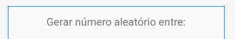
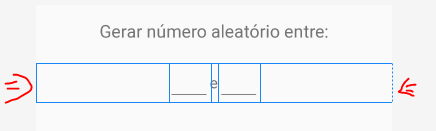
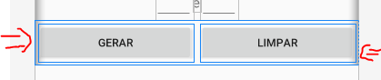
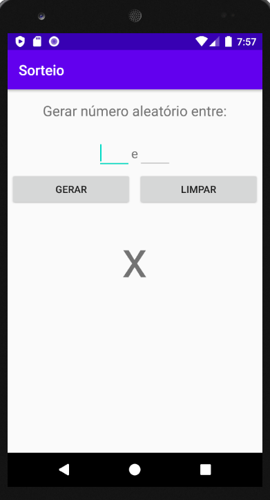
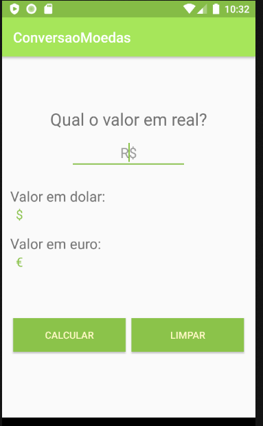

# Aula Android  App Sorteio
- Nesta aula vamos desenvolver o primeiro app
- Crie um novo projeto no android studio com o nome "Sorteio"
# 1 - Criando Layout
- O arquivo activity_main.xml é iniciado desta maneira:
```xml
<?xml version="1.0" encoding="utf-8"?>
<androidx.constraintlayout.widget.ConstraintLayout xmlns:android="http://schemas.android.com/apk/res/android"
    xmlns:app="http://schemas.android.com/apk/res-auto"
    xmlns:tools="http://schemas.android.com/tools"
    android:layout_width="match_parent"
    android:layout_height="match_parent"
    tools:context=".MainActivity">

    <TextView
        android:layout_width="wrap_content"
        android:layout_height="wrap_content"
        android:text="Hello World!"
        app:layout_constraintBottom_toBottomOf="parent"
        app:layout_constraintLeft_toLeftOf="parent"
        app:layout_constraintRight_toRightOf="parent"
        app:layout_constraintTop_toTopOf="parent" />

</androidx.constraintlayout.widget.ConstraintLayout>
```
- Observe que o layout padrão utilizado pelo Android Studio é o Constraint Layout. Utilizaremos este layout posteriormente
- Mude o layout para a seguinte estrutura
```xml
<?xml version="1.0" encoding="utf-8"?>
<LinearLayout xmlns:android="http://schemas.android.com/apk/res/android"
    xmlns:app="http://schemas.android.com/apk/res-auto"
    xmlns:tools="http://schemas.android.com/tools"
    android:layout_width="match_parent"
    android:orientation="vertical"
    android:layout_height="match_parent"
    tools:context=".MainActivity">

    <TextView
        android:layout_width="wrap_content"
        android:layout_height="wrap_content"
        android:text="Hello World!" />
</LinearLayout>
```
- `android:orientation="vertical"`: Seta o linearlayout como vertical. Ou seja, os componentes adicionados ficarão um embaixo do outro.
- Observe que retiramos os atributos relacionados ao constraint layout
## wrap_content e match_parent
- Os atributos relacionados a largura e altura são `layout_width` e `layout_heigth`
- Estes atributos podem ser preenchidos com 2 valores:
    - `wrap_content`: é uma propriedade que define o tamanho (altura ou largura) da *view* baseado no seu conteúdo. Indica que o tamanho do elemento se ajusta ao contéudo
    - `match_parent`: A view deve ocupar o espaço igual ao do seu pai.
    - OBS: existem outros, porém menos usados
    - Mostrar esse link: https://pt.stackoverflow.com/questions/214640/qual-%C3%A9-a-fun%C3%A7%C3%A3o-do-wrap-content

Adicione um TextView com o seguinte XML dentro do LinearLayout
```xml
    ...
    tools:context=".MainActivity">
    <TextView
        android:layout_width="match_parent"
        android:gravity="center"
        android:layout_height="wrap_content"
        android:layout_marginTop="16dp"
        android:textSize="20sp"
        android:text="Gerar número aleatório entre:" />
</LinearLayout>
```
Resultado:
<center></center>

.
- A largura foi definida como `match_parent` e *gravity* como `center`. Isto foi feito para centralizar o `TextView`. O atributo `gravity` centraliza o contéudo(dentro) da *view*.
- Também existe o atributo `layout_gravity`, que centraliza a *view* em relação ao atributo, como mostrado a seguir:
    ```xml
        <TextView
            android:layout_width="wrap_content"
            android:layout_gravity="center"
            ...
        />
    ```
- `android:layout_marginTop="16dp"`: Adiciona uma margem de 16dp em cima da TextView. *dp* significa densidade por pixel. É uma unidade de tamanho relativa, ou seja, o tamanho da margem varia de acordo com o tamanho da tela
- `android:textSize="20sp"`: *Scale-independent Pixels*. Utilizado para ajustar o tamanho da fonte. Ajuste conforme a tela

## Adicionar EditText
<center></center>

```xml
<LinearLayout
        android:layout_width="match_parent"
        android:layout_height="wrap_content"
        android:orientation="horizontal"
        android:gravity="center"
        android:layout_marginTop="24dp"
        >
        <EditText
            android:layout_width="48dp"
            android:id="@+id/num1"
            android:layout_height="wrap_content"
            android:inputType="number"
            />
        <TextView
            android:layout_width="wrap_content"
            android:text="e"
            android:textSize="18sp"
            android:layout_height="wrap_content"/>
        <EditText
            android:layout_width="48dp"
            android:id="@+id/num2"
            android:inputType="number"
            android:layout_height="wrap_content"/>
    </LinearLayout>
```
- Observe que adicionamos um `LinearLayout`, para adicionar itens lado-a-lado(horizontal).
- `android:layout_width="48dp"`: Fixando o tamanho do EditText
- `android:inputType="number"`: EditText aceita apenas números
- Foi utilizado o atributo `andorid:layout_gravity="center"`, para centralizar o conteúdo do LinearLayout

## Adicionar botões
<center></center>

```xml
...
    <LinearLayout
        android:layout_width="match_parent"
        android:layout_height="wrap_content"
        android:orientation="horizontal"
        >

        <Button
            android:layout_width="wrap_content"
            android:layout_height="wrap_content"
            android:text="Gerar"
            android:layout_margin="4dp"
            android:layout_weight="1"
            />
        <Button
            android:layout_margin="4dp"
            android:layout_width="wrap_content"
            android:layout_height="wrap_content"
            android:layout_weight="1"
            android:text="Limpar" />
    </LinearLayout>
</LinearLayout>
```
- `android:layout_weight="1"`: Adiciona um peso em uma view, em relação ao `LinearLayout`
- Como colocamos o mesmo peso para os dois botões, os botões tem o mesmo tamanho.
    - Altere o valor de weight para observar o comportamento

## Adicionar TextView
```xml
<TextView
        android:id="@+id/result"
        android:layout_width="wrap_content"
        android:layout_marginTop="20dp"
        android:layout_height="wrap_content"
        android:layout_gravity="center"
        android:textSize="72sp"
        android:text="x"
        />
```
- Este TextView mostrará o resultado do número aleatório

## **Layout Final:**
<center></center>

# 2. MainActivity.java
```java
public class MainActivity extends AppCompatActivity {
    //Atributos
    private EditText editNum1,editNum2;

    @Override
    protected void onCreate(Bundle savedInstanceState) {
        super.onCreate(savedInstanceState);
        setContentView(R.layout.activity_main);
        editNum1=findViewById(R.id.num1);
        editNum2=findViewById(R.id.num2);
    }
}

```
- Adicionamos dois atributos `EditText`
- O método `findViewById()` retorna o componente do layout dado o id como parâmetro
## Agora vamos adicionar um evento de click no botão gerar
```java
    public void calcular(View v){
        
    }
```
<center>MainActivity.java</center>

```xml
<Button
    android:layout_width="wrap_content"
    android:layout_height="wrap_content"
    android:text="Gerar"
    android:onClick="calcular" 
    android:layout_margin="4dp"
```
<center>activity_main.xml</center>

<h3> Agora vamos pegar as entradas do EditText e verificar se estes campos estão vazios </h3>

```java
    public void calcular(View v){
        String n1 = editNum1.getText().toString();
        String n2 = editNum2.getText().toString();

        if(n1.equals("") || n2.equals("")){
            //Caso o n1 ou n2 sejam vazios
            Toast.makeText(this,"Preencha os dois campos",Toast.LENGTH_SHORT).show();
            return;
        }
    }
```
- o método `Toast.makeText()` apresenta uma mensagem na tela. Este método tem 3 parâmetros
    - `Context`: É uma classe abstrata que fornece um ponto de acesso para informações globais sobre um ambiente de aplicativo. Como a classe `Activity` é filha de `Context`, então podemos passar a activity como parâmetro(`this`). Este conceito será explicado melhor posteriormente
    - `CharSequence`: Mensagem que queromos apresentar
    - `duration`: Duração do Toast. Podemos utilizar duas constantes: `Toast.LENGTH_SHORT` e `Toast.LENGTH_LONG`

<h3> Agora vamos converter os valores de String para Inteiros:</h3>

```java
        ...
        if(n1.equals("") || n2.equals("")) {
            //Caso o n1 ou n2 sejam vazios
            Toast.makeText(this, "Preencha os dois campos", Toast.LENGTH_SHORT).show();
            return;
        }
        Integer num1 = Integer.valueOf(n1);
        Integer num2 = Integer.valueOf(n2);
```
- `num1` e `num2` são objetos da classe `Integer`. Esta é uma classe wrapper, que, basicamente, é uma classe que representa um tipo primitivo.
- A grande vantagem desta classe é permitir atribuição de valores nulos no objeto.
- O método estático `Integer.valueOf()` converte uma `String` para `Integer`
- Mais informações: https://www.alura.com.br/artigos/diferenca-entre-int-e-integer-em-java

<h3>Agora vamos fazer uma verificação caso o 2º numero seja maior que o 1º </h3>

```java
        ...
        Integer num1 = Integer.valueOf(n1);
        Integer num2 = Integer.valueOf(n2);
        if(num1>=num2){
            Toast.makeText(this,"O 1º número deve ser menor que o 2º",Toast.LENGTH_SHORT).show();
            return;
        }
        ...
```
- Mostramos um Toast caso num1>=num2

<h3>Com isso, já fizemos todas as verificações e podemos gerar o número aleatório. Para fazer isso, vamos utilizar a classe Random </h3>

- Adicione dois atributos em `MainActivity`:
    ```java
    public class MainActivity extends AppCompatActivity {
        private EditText editNum1,editNum2;
        //Objeto para gerar numeros aleatório
        private Random gerador = new Random();
        private TextView result;
    ```
    - O atributo `gerador` será utilizado para gerar os numeros aleatórios
    - O atributo result é a View `@+id/result` do layout.

- Inicie o TextView com `findViewById()` no `onCreate()`:
    ```java
        ...
        protected void onCreate(Bundle savedInstanceState) {
            super.onCreate(savedInstanceState);
            setContentView(R.layout.activity_main);
            editNum1=findViewById(R.id.num1);
            editNum2=findViewById(R.id.num2);
            //Aqui
            result = findViewById(R.id.result);
        }
        ...
    ```
- Lógica para gerar números aleatórios e mostrar no Layout:
    ```java
            if(num1>=num2){
                Toast.makeText(this,"O 1º número deve ser menor que o 2º",Toast.LENGTH_SHORT).show();
                return;
            }
            Integer out = gerador.nextInt((num2-num1)+1)+num1;
            result.setText(out.toString());
    ```
    - Esta lógica foi retirada do seguinte link: http://www.bosontreinamentos.com.br/java/como-gerar-numeros-aleatorios-em-java-com-java-util-random-e-math-random/
    
<h3> Agora vamos configurar o botão para limpar</h3>

- Adicione um método limpar() em MainActivity.java
    ```java
        //
        public void limpar(View v){
            editNum1.setText("");
            editNum2.setText("");
            result.setText("x");
        }

    ```
- Faça a referência deste método em no Botão Limpar em activity_main.xml
    ```xml
        <Button
            android:layout_margin="4dp"
            android:layout_width="wrap_content"
            android:layout_height="wrap_content"
            android:layout_weight="1"
            android:onClick="limpar"
            android:text="Limpar" />
    ```


# Código final: 
- https://gist.github.com/clemiltonfucapi/8b1c24a6276b7b7b790e5a08cbb0e2bf


# Exercício
Fazer o seguinte app:
<center></center>

- O app deve receber um número inteiro em reais
- Caso o valor do real esteja vazio, mostre um Toast.
- Em baixo deve mostrar em 2 TextView o valor em Dolar e em Euros
- Mude as cores do aplicativo.
    - A cor do botão pode ser mudada pelo atributo: ``android:background``
    - As cores da barra superior e cor do EditText selecionado pode ser mudada no arquivo ``colors.xml``
- Os valores devem ser convertidos em duas casas decimais(https://mkyong.com/java/java-display-double-in-2-decimal-points/ )
