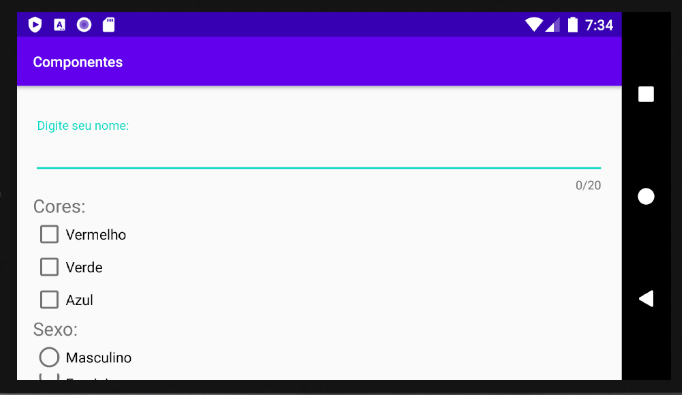

# 06 - Componentes

### Nesta aula vamos continuar o estudo alguns componentes de formulário como CheckBox, RadioButton, SeekBar.

# 1 - Criação do layout XML
- Crie um novo projeto no Android Studio com o nome **Componentes**
- Agora vamos utilizar o modo Design para criar o layout. Observe no lado esquerdo abas *Pallete* e *Component Tree*:

    <center> </center>

    - *Pallete*: apresenta os principais componentes divididos em categoria
    - *Component Tree*: apresenta a arvore de componentes(estrutura) do XML

- É possível mudar o layout pela Component Tree:
    > Botão direito Constraint Layout) > *Convert View* > *LinearLayout* <center> </center>

- Mude para LinearLayout(vertical) utilizando o modo Design:
    <center> </center>
## 1.1 - TextInputLayout
- Adicione um TextInputLayout
    <center> </center>
    
    - Este componente é uma alternativa ao EditText. 
    - Ao adicionar este componente, uma nova dependência é inserida no projeto através do arquivo `build.gradle(Module: app)`.

- O TextInputLayout fornece algumas funcionalidades interessantes como:
    - *hint*'s flutuantes
    - Mostrar mensagem de erros
    - Mostrar um contador de caracteres que foram preenchidos no input
    - Alertar ao usuário caso o numero de caracteres no input ultrapasse o permitido.
    - Adicionar um botão de visibilidade para senhas

    <center>
    <p>Algumas das funcionalidades do TextInputLayout</p>
    <p float="left">
    
     
    
    </p>
    <p>Fonte: https://www.journaldev.com/14748/android-textinputlayout-example </p>
    </center>
    


- Observe como ficou o arquivo .xml:
    ```xml
    <?xml version="1.0" encoding="utf-8"?>
    <LinearLayout xmlns:android="http://schemas.android.com/apk/res/android"
        xmlns:app="http://schemas.android.com/apk/res-auto"
        xmlns:tools="http://schemas.android.com/tools"
        android:layout_width="match_parent"
        android:layout_height="match_parent"
        android:orientation="vertical"
        android:layout_marginLeft="16dp"
        android:layout_marginRight="16dp"
        tools:context=".MainActivity">

        <com.google.android.material.textfield.TextInputLayout
            android:layout_width="match_parent"
            android:layout_height="match_parent">

            <com.google.android.material.textfield.TextInputEditText
                android:layout_width="match_parent"
                android:layout_height="wrap_content"
                android:hint="hint" />
        </com.google.android.material.textfield.TextInputLayout>
    </LinearLayout>
    ```
    - Foram adicionados dois componentes *TextInputLayout* e *TextInputEditText*. 
    - **TextInputLayout**: Nesse elemento configuramos atributos relacionados ao layout do elemento como `width`, `height`, `margin`, `padding`, `constraints(Constraint Layout)`, `gravity` entre outros. 
    - **TextInputEditText**: Este elemento é um tipo de `EditText` e podemos configurar o `inputType`, `textSize`, `id`, entre outros.
        - **ATENÇÃO**: caso quisermos pegar o texto do elemento, devemos colocar o id no ``TextInputEditText``
- Mude o TextInputLayout e TextInputEditText:
    ```xml
            <com.google.android.material.textfield.TextInputLayout
            android:layout_width="match_parent"
            android:layout_height="wrap_content"
            app:counterEnabled="true"
            app:counterMaxLength="20"
            android:layout_marginLeft="16dp"
            android:layout_marginRight="16dp"
            android:layout_marginTop="32dp"
            >

            <com.google.android.material.textfield.TextInputEditText
                android:layout_width="match_parent"
                android:layout_height="wrap_content"
                android:hint="Digite seu nome:" />
        </com.google.android.material.textfield.TextInputLayout>

    ```
    - Adicionamos margens na esquerda, direita e em cima em TextInputLayout.
    - Os atributos `app:counterEnabled` e `app:counterMaxLength`, servem para habilitar o contador de caracteres e colocar um tamanho máximo para o EditText. Note que estamos utilizando o namespace `app`.

- Adicionar um TextView. Os atributos ficam da seguinte maneira:
    ```xml

        <TextView
            android:layout_width="match_parent"
            android:layout_height="wrap_content"
            android:text="Cores:"
            android:textSize="18sp" />

    </LinearLayout>
    ```
    - Veja como deve ficar a arvore de componentes:
    <center></center>
    
    - Um erro comum é colocar outros componentes dentro do `TextInputLayout`. 

- Adicione os CheckBox
    ```xml
            <CheckBox
                android:id="@+id/checkBoxVermelho"
                android:layout_width="match_parent"
                android:layout_height="wrap_content"
                android:text="Vermelho" />
            <CheckBox
                android:id="@+id/checkBoxVerde"
                android:layout_width="match_parent"
                android:layout_height="wrap_content"
                android:text="Verde" />
            <CheckBox
                android:id="@+id/checkBoxAzul"
                android:layout_width="match_parent"
                android:layout_height="wrap_content"
                android:text="Azul" />
    ````
    - O CheckBox permite selecionar vários items ao mesmo tempo. 
    - O layout deve ficar desta maneira:
    <center></center>

- Adicionar `TextView`, `RadioGroup` e `RadioButton`
    ```xml
        <TextView
        android:layout_width="wrap_content"
        android:layout_height="wrap_content"
        android:text="Sexo: "
        android:textSize="18sp"/>
        <RadioGroup
        android:id="@+id/radioGroup"
        android:layout_width="match_parent"
        android:layout_height="wrap_content">
            <RadioButton
                android:id="@+id/radioM"
                android:layout_width="wrap_content"
                android:layout_height="wrap_content"
                android:text="Masculino"/>
            <RadioButton
                android:id="@+id/radioF"
                android:layout_width="wrap_content"
                android:layout_height="wrap_content"
                android:text="Feminino"/>
        </RadioGroup>
    ```
    - O  componente ``RadioGroup`` faz com que apenas um elemento ``RadioButton`` seja selecionado por vez. 
    - O layout deve ficar desta maneira
    <center></center>

- Adicionar `Switch`, `SeekBar` e `TextView`
    ```xml
        <Switch
            android:id="@+id/switch1"
            android:layout_width="wrap_content"
            android:layout_height="wrap_content"
            android:text="Ativar Seekbar" />
        <SeekBar
            android:id="@+id/seekBar"
            android:layout_width="match_parent"
            android:layout_height="wrap_content"
            android:max="10"
            android:progress="0" />
        <TextView
            android:id="@+id/textEscala"
            android:layout_width="match_parent"
            android:layout_height="wrap_content"
            android:text="Escala: 0/10"
            android:textSize="16sp" />

    ```
    - O layout deve ficar da seguinte maneira:
    <center></center>

- Execute o app no emulador e vire o celular:
    <center>
        <p>Observe que alguns componentes não aparecem na tela. Vamos adicionar um ScrollView</p>
    </center>

- Adicionando ScrollView
    ```xml
    <ScrollView
        xmlns:android="http://schemas.android.com/apk/res/android"
        xmlns:app="http://schemas.android.com/apk/res-auto"
        xmlns:tools="http://schemas.android.com/tools"
        android:layout_width="match_parent"
        android:layout_height="match_parent">
    <LinearLayout
        android:layout_width="match_parent"
        android:layout_height="match_parent"
        android:orientation="vertical"
        android:layout_marginLeft="16dp"
        android:layout_marginRight="16dp"
        tools:context=".MainActivity">
        ...

    </LinearLayout>
    </ScrollView>
    ```
    - Observe que foi preciso mudar os namespace `android`, `app` e `tools` para o ScrollView
    - Execute o app e veja o resultado

- Adicionando TextView e Buttons
    ```xml
        <TextView
            android:id="@+id/result"
            android:layout_width="wrap_content"
            android:layout_height="wrap_content"
            android:text="Resultado:"
            android:textSize="20sp"/>
        <Button
            android:id="@+id/btnEnviar"
            android:layout_width="match_parent"
            android:layout_height="wrap_content"
            android:text="Enviar" />
        <Button
            android:id="@+id/btnLimpar"
            android:layout_width="match_parent"
            android:layout_height="wrap_content"
            android:text="Limpar" />
    ```
    - O resultado final é:
    <center></center>

# 2 - Programando a Activity Java

- Vamos começar configurando o `TextInputEditText`,  `Checkbox`, `TextView`
```java
public class MainActivity extends AppCompatActivity {
    private TextInputEditText editNome;
    private CheckBox checkVermelho, checkVerde, checkAzul;
    private TextView textResult;

    @Override
    protected void onCreate(Bundle savedInstanceState) {
        super.onCreate(savedInstanceState);
        setContentView(R.layout.activity_main);

        editNome = findViewById(R.id.editNome);
        checkVerde = findViewById(R.id.checkBoxVerde);
        checkAzul = findViewById(R.id.checkBoxAzul);
        checkVermelho = findViewById(R.id.checkBoxVermelho);
        textResult = findViewById(R.id.textResult);
    }
}
```
- Agora vamos adicionar um evento de clique no botão Enviar, através de um **listener**
- Adicione como atributo o botão Enviar
    ```java

        ...
        private TextInputEditText editNome;
        private CheckBox checkVermelho, checkVerde, checkAzul;
        private Button btnEnviar; //<----
        ...
    ```
- Inicialize o botão com findViewById() e configure o método setOnClickListener();

    ```java
        ...
        checkAzul = findViewById(R.id.checkBoxAzul);
        btnEnviar = findViewById(R.id.btnEnviar);
        btnEnviar.setOnClickListener();
    ```
- O método setOnClickListener(), é um metodo setter(ou seja, seta um atributo), e recebe como parâmetro um objeto do tipo OnClickListener. Observe a imagem abaixo a implementação da classe View:
    <center></center>
- Abaixo temos a definição de `OnClickListener` na classe `View`:
    
    <center></center>
    
    - Observe que OnClickListener é uma **interface**. Interface é um tipo abstrato que é usado para especificar um comportamento que as classes/objetos devem implementar. 
    - Uma interface é uma espécie de contrato que quando assumido por uma classe deve ser implementado.
    - Na interface acima, quem implementar a classe `OnClickListener` deve implementar o método onClick().
    - Em resumo, para configurar um evento de click em um componente, devemos criar um `listener` que implementa o método `onClick()`
- Agora vamos implementar o onClick() no botão de Enviar:
    <center></center>
    
    - Vamos utilizar o autocomplete do Android Studio. Escreva a palavra `new` e aperte ctrl+Espaço 
- Após o autocomplete, utilize chame um método `enviar()`, que será implementado depois:
    ```java
    btnEnviar.setOnClickListener(new View.OnClickListener() {
        @Override            
        public void onClick(View v) {
            enviar()
        }
    });
    ```
- Agora vamos implementar o método enviar()
    ```java
    public void enviar(){
        String strResult = "";
        String nome = editNome.getText().toString();
        strResult +="Nome: "+nome+"\n";
        /*CheckBox*/
        if(checkVerde.isChecked()){
            strResult+="Verde selecionado!\n";
        }
        if(checkAzul.isChecked()){
            strResult+="Azul selecionado!\n";
        }
        if(checkVermelho.isChecked()){
            strResult+="Vermelho selecionado!\n";
        }
        textResult.setText(strResult);
    }
    ```

- Execute o app e veja o resultado:
    <center></center>
- Agora vamos configurar o RadioButton:
    ```java
    public class MainActivity extends AppCompatActivity {
        ...
        private RadioButton radioM,radioF;
        @Override
        protected void onCreate(Bundle savedInstanceState){
            ...
            radioM = findViewById(R.id.radioM);
            radioF = findViewById(R.id.radioF);
            btnEnviar = findViewById(R.id.btnEnviar);
        }
    ```
- Método enviar()
    ```java
        ....
        /* Configurando RadioButton */
        if(radioM.isChecked()) {
            strResult += "Sexo: Masculino";
        }
        if(radioF.isChecked()){
            strResult+="Sexo: Feminino";
        }
        /* Setando o resultado */
        textResult.setText(strResult);
    }
    ```
- Executar o app e verificar o funcionamento do radioGroup.
#
- Agora vamos implementar um Listener para o radioGroup
    - Adicione um id para o RadioGroup
    ```xml
        <RadioGroup
        android:id="@+id/radioGroup"
        android:layout_width="match_parent"
        android:layout_height="wrap_content">
        <!-- activity_main.xml !>
    ```
- Adicione atributo e findViewById:
    ```java
        ...
        private RadioButton radioM,radioF;
        //Adicionar aqui
        private RadioGroup radioGroup;

        @Override
        protected void onCreate(Bundle savedInstanceState) {
            ...
            //Adicionar aqui 
            radioGroup = findViewById(R.id.radioGroup);
            ...
    ```
- Método radioGroupListener
    ```java
    public void radioGroupListener(){
       radioGroup.setOnCheckedChangeListener(new RadioGroup.OnCheckedChangeListener() {
            @Override
            public void onCheckedChanged(RadioGroup group, int checkedId) {
                if(checkedId==R.id.radioM){
                    //inner class
                    Toast.makeText(getApplicationContext(),"M",Toast.LENGTH_SHORT).show();
                }else{
                    Toast.makeText(getApplicationContext(),"F",Toast.LENGTH_SHORT).show();
                }
            }
        });
    }
    ```
    - Adicionamos o listener `setOnCheckedChangeListener` no radioGroup. Ele é ativado quando alguma das opções for selecionada.
    - Observe os parâmetros do método `onCheckedChanged`:
        - `RadioGroup group`: Referência para o radioGroup
        - `int checkedId`: Id do radioButton selecionado.
    - Para mostrar o Toast utilizamos o método `getApplicationContext()`, pois o escopo do método `onCheckedChanged` não permite utilizar a referência `this`.

- Chamar o método `radioGroupListener()`
    ```java
    @Override
    protected void onCreate(Bundle savedInstanceState) {
        ...
        btnEnviar.setOnClickListener(new View.OnClickListener() {
            @Override
            public void onClick(View v) {
                enviar();
            }
        });
        //Adicionar aqui
        radioGroupListener();
    }
    ```
    #
- Agora vamos configurar o switch:
    - Mude o switch em activity_xml:
    ```xml
        <Switch
        android:id="@+id/switch1"
        android:layout_width="wrap_content"
        android:layout_height="wrap_content"
        android:text="Desligado" />
    ```
    - Adicione um atributo e findViewById()
    ```java
        ...
        private RadioGroup radioGroup;
        //Adicionar aqui
        private Switch switch1;

        @Override
        protected void onCreate(Bundle savedInstanceState) {
            ...
            //Adicionar aqui 
            switch1 = findViewById(R.id.switch1);
            ...
    ```
    - Adicionar método switchListener:
    ```java
    public void switchListener(){
        switch1.setOnCheckedChangeListener(new CompoundButton.OnCheckedChangeListener() {
            @Override
            public void onCheckedChanged(CompoundButton buttonView, boolean isChecked) {
                if(isChecked){
                    switch1.setText("Ligado!");
                }else{
                    switch1.setText("Desligado!");
                }
            }
        });
    }
    ```
    - Chamar método `switchListener`:
     ```java
    @Override
    protected void onCreate(Bundle savedInstanceState) {
        ...
        radioGroupListener();
        //Adicionar aqui
        switchListener();
    }
    ```
#
- Agora vamos configurar o Seekbar:
    - Adicione atributo e findViewById:
    ```java
        ...
        private RadioGroup radioGroup;
        private Switch switch1;
        //Adicionar aqui
        private Seekbar seekBar;

        @Override
        protected void onCreate(Bundle savedInstanceState) {
            ...
            switch1 = findViewById(R.id.switch1);
            //Adicionar aqui 
            seekBar = findViewById(R.id.seekBar);
            ...
    ```
    - Método `seekBarListener()`:
    ```java
        public void seekBarListener(){
        seekBar.setOnSeekBarChangeListener(new SeekBar.OnSeekBarChangeListener() {
            @Override
            public void onProgressChanged(SeekBar seekBar, int progress, boolean fromUser) {

            }

            @Override
            public void onStartTrackingTouch(SeekBar seekBar) {

            }

            @Override
            public void onStopTrackingTouch(SeekBar seekBar) {

            }
        });
    }
    ```
    - Note que o listener `setOnSeekBarChangeListener` tem três métodos para serem implementados:
    - `onProgressChanged`: É chamado quando o progresso do seekBar foi alterado. Pode-se verificar se a alteração foi iniciado pelo usuário ou não.
    - `onStartTrackingTouch`: É chamado quando o usuário iniciou um gesto de toque. 
    - `onStopTrackingTouch`: É chamado quando o usuário termina um gesto de toque.
    #
    - Adicione um Toast no seekbar:
    ```java
    ...
    seekBar.setOnSeekBarChangeListener(new SeekBar.OnSeekBarChangeListener() {
            @Override
            public void onProgressChanged(SeekBar seekBar, int progress, boolean fromUser) {
                Toast.makeText(getApplicationContext(),progress+"",Toast.LENGTH_SHORT).show();
            }
            ...
    ```
    - Observe que conforme o seekBar muda, uma notificação Toast aparece. Precisamos mudar o TextView da escala:
    - Adicionar atributo e findViewById:
    ```java
        ...
        private TextView textResult,textEscala;
        @Override
        protected void onCreate(Bundle savedInstanceState) {
            ...
            //Adicionar aqui 
            textEscala = findViewById(R.id.textEscala);
            ...
    ```
    - Modificar método `onProgressChanged`:
    ```java
        seekBar.setOnSeekBarChangeListener(new SeekBar.OnSeekBarChangeListener() {
            @Override
            public void onProgressChanged(SeekBar seekBar, int progress, boolean fromUser) {
                //Toast.makeText(getApplicationContext(),progress+"",Toast.LENGTH_SHORT).show();
                textEscala.setText("Escala: "+progress+"/10");
            }
            ...
        });
    ```
    - Executar app e ver o resultado

# Codigo final:
> https://gist.github.com/clemiltonfucapi/b395e5c161287c910f0dd3840aa429b2 

# Exercício - Projeto Pedidos

## Parte 01
- Desenvolver o seguinte layout:
<center></center>
- O comportamento do layout deve seguir o vídeo:

### Video https://drive.google.com/file/d/1VJKrLEIfTURzQfeiqX6aB3aimwfuq-8Y/view?usp=sharing

