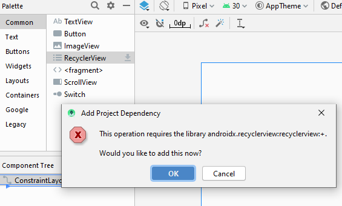
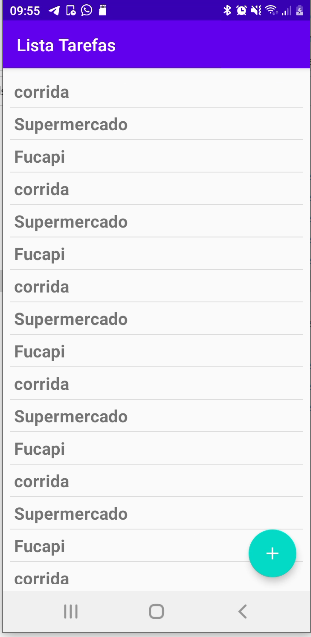
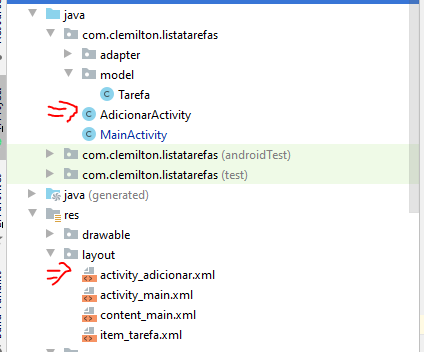
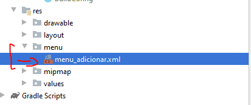
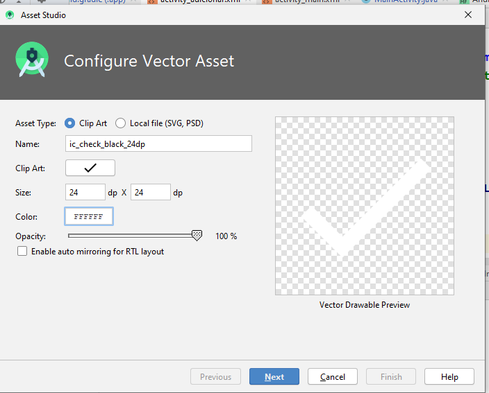
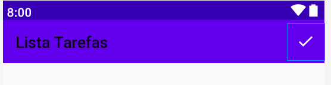

# RecyclerView - Teoria
- O RecyclerView é uma atualização do ListView e também do GridView, os quais estão presentes desde as versões iniciais do Android
- A principal vantagem em se utilizar o RecyclerView,  é o controle de “reciclagem” de um item dentro da View aonde este é exibido, isto é, os itens que não estão mais visíveis em uma lista são “reciclados” para criar os novos itens que estarão dispostos na tela.
<center></center>

## Componentes RecyclerView:
- Os Principais componentes da RecyclerView são:
    - RecyclerView
    - Adapter
    - ViewHolder
    - LayoutManager
    <center></center>
### RecyclerView
- Componente visual que ficará na *Activity/Fragment* e irá posicionar a lista na tela do usuário, assim como um campo de texto ou botão, por exemplo.
### Adapter
<center></center>

- é um Padrão de Projeto(GoF) que converte a interface de uma classe para outra interface.
-  Os itens  são inseridos na ListView usando um **Adapter** que é responsável por gerenciar e adaptar os dados
- Os dados geralmente estão dentro de um `ArrayList<T>`:

### ViewHolder
- É a referência para a view que é a parte visual de cada item da lista, que será replicada para todos elementos (na estrutura acima, ficaria dentro do Adapter).

### LayoutManger
- Define qual será a posição dos itens na lista (se será uma lista horizontal, vertical, uma grade e etc).
- Com essa flexibilidade podemos mudar a disposição dos itens de acordo com a configuração do usuário sem a necessidade de recriar toda a estrutura do RecyclerView em tempo de execução.

# Implementação

- Crie um novo projeto chamado Lista de tarefas.
- Criar um novo pacote chamado ``model`` e inserir criar uma classe ``Tarefa``
    - 
    ```java
    package com.example.listadetarefas2.model;

    public class Tarefa {
        private String tarefa;

        public Tarefa(String tarefa) {
            this.tarefa = tarefa;
        }

        public String getTarefa() {
            return tarefa;
        }

        public void setTarefa(String tarefa) {
            this.tarefa = tarefa;
        }
    }
    ```
- No codigo a seguir estamos preenchendo um ``ArrayList``
    ```java
    public class MainActivity extends AppCompatActivity {
        private ArrayList<Tarefa> listaTarefas = new ArrayList<>();

        @Override
        protected void onCreate(Bundle savedInstanceState) {
            super.onCreate(savedInstanceState);
            setContentView(R.layout.activity_main);

            preencherLista();
        }

        public void preencherLista(){
            /* 1º - Estático, depois B.D */
            for(int i =0; i <30 ; i++){
                listaTarefas.add(new Tarefa("Corrida"));
                listaTarefas.add(new Tarefa("Supermercado"));
                listaTarefas.add(new Tarefa("Fucapi"));
            }
        }
    }
    ```
- Agora vamos adicionar uma RecyclerView em ``activity_main.xml``:
    - 
- Coloque as constraints e margens na RecyclerView:
    ```xml
    <?xml version="1.0" encoding="utf-8"?>
    <androidx.constraintlayout.widget.ConstraintLayout xmlns:android="http://schemas.android.com/apk/res/android"
        xmlns:app="http://schemas.android.com/apk/res-auto"
        xmlns:tools="http://schemas.android.com/tools"
        android:layout_width="match_parent"
        android:layout_height="match_parent"
        tools:context=".MainActivity">

    <androidx.recyclerview.widget.RecyclerView
            android:id="@+id/recyclerTarefas"
            android:layout_width="match_parent"
            android:layout_height="match_parent"
            android:layout_marginStart="8dp"
            android:layout_marginLeft="8dp"
            android:layout_marginTop="8dp"
            android:layout_marginEnd="8dp"
            android:layout_marginRight="8dp"
            android:layout_marginBottom="8dp"
            app:layout_constraintBottom_toBottomOf="parent"
            app:layout_constraintEnd_toEndOf="parent"
            app:layout_constraintStart_toStartOf="parent"
            app:layout_constraintTop_toTopOf="parent" />
    </androidx.constraintlayout.widget.ConstraintLayout>
    ```
    - 
- Agora vamos criar um layout de um elemento: ``layout/item_tarefa.xml``:
    - 
    ```xml
    <?xml version="1.0" encoding="utf-8"?>
    <LinearLayout
        xmlns:android="http://schemas.android.com/apk/res/android" 
        android:layout_width="match_parent"
        android:layout_height="wrap_content"
        android:focusable="true"
        android:clickable="true"
        android:foreground="?android:attr/selectableItemBackground"
        android:padding="5dp">
        <TextView
            android:id="@+id/nomeTarefa"
            android:layout_width="wrap_content"
            android:layout_height="wrap_content"
            android:textSize="20sp"
            android:text="Tarefa"
            android:textStyle="bold"
            />
    </LinearLayout>
    ```
    - Resutado do Layout: 
    - 
- Crie um atributo para a RecyclerView:
```java
package com.example.listadetarefas2;

import androidx.appcompat.app.AppCompatActivity;
import androidx.recyclerview.widget.RecyclerView;

import android.os.Bundle;

import com.example.listadetarefas2.model.Tarefa;

import java.util.ArrayList;

public class MainActivity extends AppCompatActivity {
    private ArrayList<Tarefa> listaTarefas = new ArrayList<>();
    //adicionar recycler
    private RecyclerView recyclerView;

    @Override
    protected void onCreate(Bundle savedInstanceState) {
        super.onCreate(savedInstanceState);
        setContentView(R.layout.activity_main);
        recyclerView = findViewById(R.id.recyclerTarefas);
        preencherLista();


    }
    ...
}

```
- Agora vamos criar o adaptador para a RecyclerView:
    - 
    ```java
    public class TarefaAdapter {

        /* Classe ViewHolder -> Representa um elemento da recycler*/
        public class TarefaVH extends RecyclerView.ViewHolder{
            TextView tarefa;
            public TarefaVH(@NonNull View itemView) {
                super(itemView);
                tarefa = itemView.findViewById(R.id.nomeTarefa);
            }
        }
    }
    ```
    - Criamos uma classe interna chamada ``TarefaVH``. Esta classe fará o papel da ViewHolder, ou seja, representa um elemento da *RecyclerView*.
    - O parâmetro ``itemView``  representa o layout ``item_tarefa.xml`` convertido p/ View
    - Para criar uma classe ``ViewHolder`` devemos herdar a classe ``RecyclerView.ViewHolder``
- Agora vamos implementar o Adapter:
    - Implemente os métodos abstratos da classe Adapter 
    ```java
    public class TarefaAdapter extends RecyclerView.Adapter<TarefaAdapter.TarefaVH> {
        //atributos
        private Context context;
        private ArrayList<Tarefa> listaTarefas;
        
        //construtor
        public TarefaAdapter(Context context, ArrayList<Tarefa> lista){
            this.context = context;
            this.listaTarefas = listaTarefas;
        }

        @NonNull
        @Override
        public TarefaVH onCreateViewHolder(@NonNull ViewGroup parent, int viewType) {
            return null;
        }

        @Override
        public void onBindViewHolder(@NonNull TarefaVH holder, int position) {

        }

        @Override
        public int getItemCount() {
            return 0;
        }
        .....

    ```
    - Criamos dois atributos, ``context`` e ``listaTarefas``.
    - O atributo ``context`` guarda um objeto do tipo ``Context`` para ser utilizado fora da activity. A classe contexto permite acesso à recursos e classes específicas do Android: Ex: Iniciar Activities, BroadCast, etc. Neste caso, vamos utilizar para inflar as Views e criar eventos de clique.
    - O atributo ``listaTarefas`` guarda os dados das tarefas.
    - O construtor inicializa os atriubutos
- Agora vamos implementar os métodos do ``TarefaAdapter``
- ``getItemCount()``
    ```java
    @Override
    public int getItemCount() {
        return listaTarefas.size();
    }
    ```
    - Este método deve retorna o número de elementos que a Recycler deve ter. Neste caso é o mesmo número de elementos do ArrayList

- ``onCreateViewHolder()``
    ```java
    public TarefaVH onCreateViewHolder(@NonNull ViewGroup parent, int viewType) {
        //criando um inflater: objeto que converte XML em VIEW
        LayoutInflater l = LayoutInflater.from(context);
        //convertendo XML em View
        View itemLista = l.inflate(R.layout.item_tarefa,parent,false);
        //criando ViewHolder
        return new TarefaVH(itemLista);
    }
    ```
    - Este método tem como objetivo instanciar um objeto do tipo ``TarefaVH``. 
- ``onBindViewHolder()``
    ```java
    @Override
    public void onBindViewHolder(@NonNull TarefaVH holder, int position) {
        Tarefa tarefa = listaTarefas.get(position);
        holder.textTarefa.setText(tarefa.getTarefa());
    }
    ```
    - Este método deve juntar os dados(ArrayList) com as Views.
- Agora vamos reconfigurar o código do onCreate
```java
    @Override
    protected void onCreate(Bundle savedInstanceState) {
        super.onCreate(savedInstanceState);
        setContentView(R.layout.activity_main);
        recyclerView = findViewById(R.id.recyclerTarefas);
        preencherLista();
        //setando o gerenciador de layouts
        recyclerView.setLayoutManager(new LinearLayoutManager(this));
        //setando adapter
        recyclerView.setAdapter(new TarefaAdapter(getApplicationContext(),listaTarefas));
        //criando um separador de itens
        recyclerView.addItemDecoration(new DividerItemDecoration(getApplicationContext(), LinearLayout.VERTICAL));

    }
```
#
# Aula 31-05 - Eventos de click na RecyclerView
- Código até o momento: https://gist.github.com/clemiltonfucapi/d0ceb468646d23ff54da923fb5af5e98
- 
- Agora vamos começar a implementar o evento de cliques em cada elemento. A RecyclerView não tem configurado o evento de click por padrão. Porém podemos configurar o click no código da ``ViewHolder``: 
    ```java
    /* Classe ViewHolder -> Representa um elemento da recycler*/
    public class TarefaVH extends RecyclerView.ViewHolder{
        TextView textTarefa;
        public TarefaVH(@NonNull View itemView) {
            super(itemView);
            textTarefa = itemView.findViewById(R.id.nomeTarefa);
            /* adicionando evento em itemView*/
            itemView.setOnClickListener(new View.OnClickListener() {
                @Override
                public void onClick(View v) {
                    int position = getBindingAdapterPosition();
                    Toast.makeText(context, "Posicao: "+position, Toast.LENGTH_SHORT).show();
                }
            });

        }
    }
    ```
    - O código acima funciona, porém o ideal é a implementação do método onClick seja feita na Activity, para que o codigo da Recycler seja reaproveitável.
- Vamos resolver esse problema através de uma interface. Crie um novo arquivo chamado ``OnItemClickListener.java``:
    - 
    ```java
    package com.example.listadetarefas2.adapter;

    public interface OnItemClickListener {
        void onItemClick(int position);
        
    }
    ```
    - Esta interface será utilizada de ponte entre a ``Activity`` e cada elemento ``ViewHolder``. 
- Criar um atributo do tipo ``OnItemClickListener``
```java
public class TarefaAdapter extends RecyclerView.Adapter<TarefaAdapter.TarefaVH> {
    private Context context;
    private ArrayList<Tarefa> listaTarefas;
    private OnItemClickListener listener;
    /* setter do listerner*/
    public void setOnItemClickListener(OnItemClickListener listener) {
        this.listener = listener;
    }
    ....
}
```
- Agora vamos modificar o código da ``ViewHolder``, associando a interface que nós criamos com o evento de clique.
    ```java
    public TarefaVH(@NonNull View itemView) {
        super(itemView);
        textTarefa = itemView.findViewById(R.id.nomeTarefa);

        itemView.setOnClickListener(new View.OnClickListener() {
            @Override
            public void onClick(View v) {
                if(listener!=null){
                    int position = getBindingAdapterPosition();
                    /* associação interface<->onClick*/ 
                    listener.onItemClick(position);
                }

            }
        });
    }
    ```
- Agora vamos implementar o evento de click em ``MainActivity.java``
```java

public class MainActivity extends AppCompatActivity {
    .....
    @Override
    protected void onCreate(Bundle savedInstanceState) {
        ......
        //setando o gerenciador de layouts
        recyclerView.setLayoutManager(new LinearLayoutManager(this));

        TarefaAdapter tarefaAdapter = new TarefaAdapter(getApplicationContext(),listaTarefas);
        /* implementando evento de click */
        tarefaAdapter.setOnItemClickListener(new OnItemClickListener() {
            @Override
            public void onItemClick(int position) {
                Tarefa tarefa = listaTarefas.get(position);
                Toast.makeText(getApplicationContext(),tarefa.getTarefa() + position,Toast.LENGTH_SHORT).show();
            }
        });
        //setando adapter
        recyclerView.setAdapter(tarefaAdapter);
        //criando um separador de itens
        recyclerView.addItemDecoration(new DividerItemDecoration(getApplicationContext(), LinearLayout.VERTICAL));
    }
    ....
}
```
- Agora vamos adicionar um botão flutuante no Layout. Vamos criar um elemento ``drawable``
    - 
    - Código Gerado:
    ```xml
    <vector android:height="24dp" android:tint="#FFFFFF"
    android:viewportHeight="24.0" android:viewportWidth="24.0"
    android:width="24dp" xmlns:android="http://schemas.android.com/apk/res/android">
        <path android:fillColor="#FF000000" android:pathData="M19,13h-6v6h-2v-6H5v-2h6V5h2v6h6v2z"/>
    </vector>
    ```
    
- Vamos mudar o layout da activity_main.xml. Primeiro vamos criar um novo layout chamado ``content_main.xml``:
```xml
<?xml version="1.0" encoding="utf-8"?>
<androidx.constraintlayout.widget.ConstraintLayout xmlns:android="http://schemas.android.com/apk/res/android"
    xmlns:app="http://schemas.android.com/apk/res-auto"
    xmlns:tools="http://schemas.android.com/tools"
    android:layout_width="match_parent"
    android:layout_height="match_parent"
    tools:context=".MainActivity">
    <androidx.recyclerview.widget.RecyclerView
        android:id="@+id/recyclerTarefas"
        tools:listitem="@layout/item_tarefa"
        android:layout_width="match_parent"
        android:layout_height="match_parent"
        android:layout_marginStart="8dp"
        android:layout_marginLeft="8dp"
        android:layout_marginTop="8dp"
        android:layout_marginEnd="8dp"
        android:layout_marginRight="8dp"
        android:layout_marginBottom="8dp"
        app:layout_constraintBottom_toBottomOf="parent"
        app:layout_constraintEnd_toEndOf="parent"
        app:layout_constraintStart_toStartOf="parent"
        app:layout_constraintTop_toTopOf="parent" />
</androidx.constraintlayout.widget.ConstraintLayout>
```
- Adicione um FloatActionButton no Layout(``activity_main.xml``):
    - 
    - Este botão adiciona uma dependência no projeto em ``build.gradle(app)``
    ```gradle
    dependencies {
        implementation fileTree(dir: 'libs', include: ['*.jar'])

        implementation 'androidx.appcompat:appcompat:1.3.0'
        implementation 'androidx.constraintlayout:constraintlayout:2.0.4'
        testImplementation 'junit:junit:4.12'
        androidTestImplementation 'androidx.test.ext:junit:1.1.2'
        androidTestImplementation 'androidx.test.espresso:espresso-core:3.3.0'
        implementation 'androidx.recyclerview:recyclerview:1.2.0'
        /* dependência do FloatActionButton */
        implementation 'com.google.android.material:material:1.3.0'
    }
    ```
- Altere ``activity_main.xml`` para ``FrameLayout``
    - 
```xml
<?xml version="1.0" encoding="utf-8"?>
<FrameLayout xmlns:android="http://schemas.android.com/apk/res/android"
    xmlns:app="http://schemas.android.com/apk/res-auto"
    xmlns:tools="http://schemas.android.com/tools"
    android:layout_width="match_parent"
    android:layout_height="match_parent"
    tools:context=".MainActivity">

    <include layout="@layout/content_main"/>

    <com.google.android.material.floatingactionbutton.FloatingActionButton
        android:id="@+id/floatingActionButton"
        android:layout_width="wrap_content"
        android:layout_height="wrap_content"
        android:layout_margin="16dp"
        android:layout_gravity="bottom|end"
        android:clickable="true"
        android:src="@drawable/ic_add_24dp" />
</FrameLayout>
```
- O layout deve ficar assim: 
    - 
- Crie uma nova Activity chamada ``AdicionarActivity``:
    - File > New > Activity > Empty Activity
    - Resultado: 
- Vamos adicionar um evento de clique no ``FloatActionButton`` para abrir a nova activity.
- ``MainActivity.java``: Adicione o atributo do botão e findViewById:
    ```java
    public class MainActivity extends AppCompatActivity {
        private ArrayList<Tarefa> listaTarefas = new ArrayList<>();
        private RecyclerView recyclerView;
        /* atributo */
        private FloatingActionButton fab;
        @Override
        protected void onCreate(Bundle savedInstanceState) {
            super.onCreate(savedInstanceState);
            setContentView(R.layout.activity_main);
            recyclerView = findViewById(R.id.recyclerView);
            /* findViewById do fab*/
            fab= findViewById(R.id.floatingActionButton);
    ```
- ``MainActivity.java``: Adicionar evento de clique no botão
    ```java
    @Override
    protected void onCreate(Bundle savedInstanceState) {
        super.onCreate(savedInstanceState);
        setContentView(R.layout.activity_main);
        recyclerView = findViewById(R.id.recyclerView);
        fab= findViewById(R.id.floatingActionButton);

        .......
        /* Evento de clique */
        fab.setOnClickListener(new View.OnClickListener() {
            @Override
            public void onClick(View view) {
                /* Criando Intenção para abrir nova activity */
                Intent intent = new Intent(getApplicationContext(),AdicionarActivity.class);
                startActivity(intent);

            }
        });

    }
    ```
    - Um Intent é um objeto que fornece vínculos de tempo de execução entre componentes separados, como duas atividades. 
    - O Intent representa a intenção do app de fazer algo
    -  Você pode usar intents para uma ampla variedade de tarefas, mas, nesta lição, a intent iniciará outra atividade.
- Agora vamos fazer o layout ``activity_adicionar.xml``:
```xml
<?xml version="1.0" encoding="utf-8"?>
<androidx.constraintlayout.widget.ConstraintLayout xmlns:android="http://schemas.android.com/apk/res/android"
    xmlns:app="http://schemas.android.com/apk/res-auto"
    xmlns:tools="http://schemas.android.com/tools"
    android:layout_width="match_parent"
    android:layout_height="match_parent"
    tools:context=".AdicionarActivity">

    <com.google.android.material.textfield.TextInputLayout
        android:layout_width="0dp"
        android:layout_height="wrap_content"
        android:layout_marginStart="8dp"
        android:layout_marginTop="16dp"
        android:layout_marginEnd="8dp"
        app:layout_constraintEnd_toEndOf="parent"
        app:layout_constraintStart_toStartOf="parent"
        app:layout_constraintTop_toTopOf="parent">

        <com.google.android.material.textfield.TextInputEditText
            android:id="@+id/textTarefa"
            android:layout_width="match_parent"
            android:layout_height="wrap_content"
            android:hint="Digite uma tarefa" />
    </com.google.android.material.textfield.TextInputLayout>
</androidx.constraintlayout.widget.ConstraintLayout>
```
- Agora vamos criar um menu em ``AdicionarActivity``. Primeiro crie a seguinte estrutura nas pasta ``res``
    - 
    - File > New > Android Resourse Directory > Selecione a opção "Resource Type" para menu
    - Crie um arquivo na pasta menu chamado ``menu_adicionar.xml``
- Crie um novo ``Vector Asset`` na pasta drawable: 
- ``menu/menu_adicionar.xml``: Adicione um item no menu:
    ```xml
    <?xml version="1.0" encoding="utf-8"?>
    <menu xmlns:android="http://schemas.android.com/apk/res/android"
        xmlns:app="http://schemas.android.com/apk/res-auto">
        <item
            android:id="@+id/itemSalvar"
            android:title="Salvar"
            android:icon="@drawable/ic_check_black_24dp"
            android:orderInCategory="100"
            app:showAsAction="always"
            />
    </menu>
    ```
    - ``android:icon``: seta o icone do item.
    - ``android:orderInCategory``: seta a ordem em que o item irá aparecer no menu. Por padrão colocamos numeros com 3 dígitos variando de 100 em 100 (Ex: 1º Item - 100, 2º Item - 200).
    - ``app:showAsAction``: Seta se a opção irá ficar na ``ActionBar``, ou no menu de opções.
- O Menu acima deve ficar assim no modo Design: 
    - 
- ``AdicionarActivity``: Vamos adicionar dois métodos para configurar o menu
    ```java
    public class AdicionarActivity extends AppCompatActivity {
        @Override
        protected void onCreate(Bundle savedInstanceState) {
            super.onCreate(savedInstanceState);
            setContentView(R.layout.activity_adicionar);
        }

        /* Criação de menu */
        @Override
        public boolean onCreateOptionsMenu(Menu menu) {
            getMenuInflater().inflate(R.menu.menu_adicionar,menu);
            return super.onCreateOptionsMenu(menu);
        }

        @Override
        public boolean onOptionsItemSelected(@NonNull MenuItem item) {
            switch(item.getItemId()){
                case R.id.itemSalvar:
                    Toast.makeText(this,"Salvar",Toast.LENGTH_SHORT).show();
            }
            return super.onOptionsItemSelected(item);
        }
    }
    ```
    - Foram criados dois métodos para configurar o menu:
        - ``onCreateOptionsMenu(Menu menu)``
        - ``onOptionsItemSelected(@NonNull MenuItem item)``
    - ``onCreateOptionsMenu(Menu menu)``: este método é utilizado para criar o Menu. Nele inflamos o layout XML feito anteriormente no parâmetro Menu.
    - ``onOptionsItemSelected(@NonNull MenuItem item)``: Esse método é executado, toda vez que um item do menu é clicado. Na implementação dele, temos um switch-case, onde verificamos qual item foi clicado.


