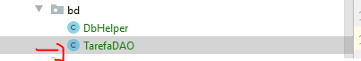
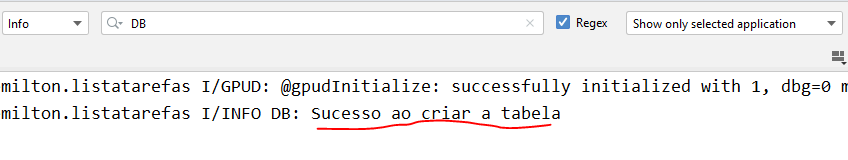
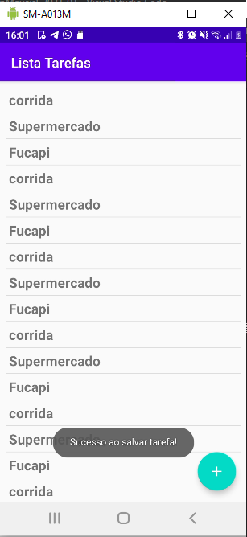
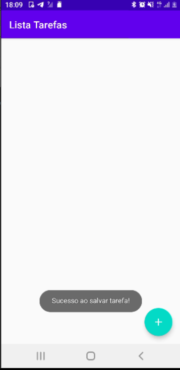
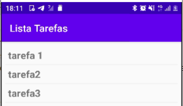
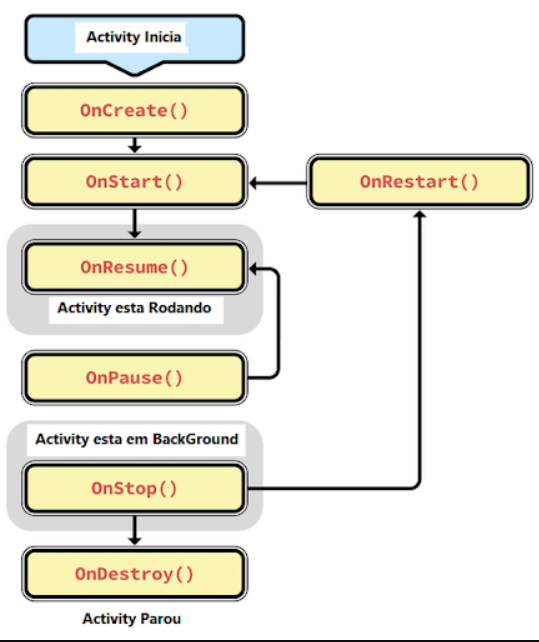

# SQLite no Android
## Introdução
- O SQLite é um banco de dados relacional open-source e fornece suporte para comandos SQL.
- Cada aplicação Android pode criar quantos bancos de dados desejar e eles irão ficar armazenados no sistema, mas vale lembrar que o banco de dados criado pela aplicação não pode ser acessado nem visualizado por outra aplicação, apenas pela que o criou.
## API de Acesso
- Para fazer o acesso ao banco de dados SQLite dentro da plataforma Android iremos utilizar uma API de acesso, a qual já vem no pacote SDK
- Duas classes serão utilizadas para a criação do banco de dados via aplicação e ambas podem ser vistas no código da mais abaixo:
    - ``SQLiteDatabase``: Classe que contém os métodos de manipulação dos dados no banco;
    - ``SQLiteOpenHelper``: Classe responsável pela criação do banco e também responsável pelo versionamento do mesmo.
- Crie um novo pacote chamado ``bd`` e uma nova classe em ``bd\DbHelper.java``
    ```java
    public class DbHelper extends SQLiteOpenHelper {
        public static int VERSION=1;
        public static String NOME_DB="DB_TAREFAS";
        public static String TABELA_TAREFAS="tarefas"; 
        public DbHelper(Context context){
            super(context,NOME_DB,null,VERSION);
        }

        @Override
        public void onCreate(SQLiteDatabase db) {

        }
        @Override
        public void onUpgrade(SQLiteDatabase db, int oldVersion, int newVersion) {

        }
    }
    ```
    - A classe ``DbHelper`` é filha de ``SQLiteOpenHelper``, a qual exige a implementação de um construtor e os métodos ``onCreate()`` e ``onUpgrade()``
    - ``DbHelper(Context context)``: Construtor da classe. Aqui passamos para o construtor da classe pai o contexto, nome do banco e versão do B.D
    - ``onCreate(SQLiteDatabase db)``: Este método é executado quando o aplicativo é instalado. Aqui vamos criar as tabelas do banco de dados
    - ``onUpgrade(SQLiteDatabase db, int oldVersion, int newVersion)``: Esse método é executado, quando uma nova versão do banco de dados é feita. Com isso podemos atualizar as tabelas e dados.
- Implementação do método ``onCreate()``:
    ```java
    @Override
    public void onCreate(SQLiteDatabase db) {
        String sql = "CREATE TABLE IF NOT EXISTS "+ TABELA_TAREFAS +
                    "(id INTEGER PRIMARY KEY AUTOINCREMENT, "+
                    " nome TEXT NOT NULL); ";
        try {
            db.execSQL(sql);
            Log.i("INFO DB","Sucesso ao criar a tabela ");
        }catch (Exception e){
            Log.i("INFO DB","Erro ao criar a tabela: "+e.getMessage());
        }
    }
    ```
    - Neste método, criamos uma Query em formato de String para criar uma tabela.
    - O comando ``db.execSQL(sql)``, executa a query. Perceba que há um tratamento de exceção(``try/catch``). Caso ocorra algum erro ao criar a tabela, a cláusula ``catch`` é executada, mostrando o erro no Log.
- Implementação do ``onUpgrade()``:
    ```java
    public void onUpgrade(SQLiteDatabase db, int oldVersion, int newVersion) {
        String sql = "DROP TABLE IF EXISTS "+TABELA_TAREFAS+";";
        try{
            db.execSQL(sql);
            this.onCreate(db);
            Log.i("INFO DB", "Sucesso ao atualizar o APP");
        }catch (Exception e ){
            Log.i("INFO DB", "Erro ao atualizar APP"+ e.getMessage());
        }
    }
    ```
    - Este método é executado toda vez que a versão do banco é mudada. Fizemos apenas uma atualização, onde dropamos a tabela de tarefas e criamos de novo o banco.
    - Mais tarde, vamos utilizar esse método para criar novos campos na tabela de tarefas.
# Salvando Tarefa
- Agora vamos criar uma classe ``TarefaDAO`` que faz as operações de CRUD de Tarefa
    - 
- ``TarefaDAO``:
    ```java
    public class TarefaDAO {
        private SQLiteDatabase escreve;
        private SQLiteDatabase le;

        public TarefaDAO(Context context){
            DbHelper db = new DbHelper(context);
            escreve = db.getWritableDatabase();
            le = db.getReadableDatabase();
        }
    }
    ```
    - Nesta classe vamos ter dois atributos(``le`` e ``escreve``). Eles serao utilizados dependendo da operação que vamos fazer(leitura ou escrita)
    - No construtor de ``TarefaDAO``, instaciamos um ``DbHelper`` e inicializamos os atributos.
- Vamos fazer um método para salvar uma tarefa em ``TarefaDAO.java``:
    ```java
    public boolean salvar(Tarefa tarefa){
        ContentValues cv = new ContentValues();
        cv.put("nome",tarefa.getTarefa());
        try {
            escreve.insert(DbHelper.TABELA_TAREFAS, null, cv);
        }catch(Exception e ){
            Log.e("ERRO BD", "Erro ao salvar a tarefa "+ e.getMessage());
            return false;
        }
        return true;
    }
    ```
    - Primeiro criamos um objeto do tipo ``ContentValues``. Através objeto ``cv``, vamos inserir os dados no ``SQLite``. Na segunda linha adicionamos o nome da tarefa no objeto ``cv``
    - A inserção é feita através do método ``insert``, que recebe como parâmetro o nome da tabela e o objeto ``ContentValues``. A inserção está dentro de um tratamento de exceção, para evitar o aplicativo fechar se ocorrer algum erro
    - O método ``salvar`` retorna ``true``, caso a inserção seja feita com sucesso!.
- Agora vamos configurar a activity, para conseguir salvar uma tarefa.
- ``AdicionarActivity.java``
    ```java
    public class AdicionarActivity extends AppCompatActivity {
        //Atributo do XML
        private TextInputEditText editTarefa;
        //TarefaDAO -> Atributo que será usado para manipular B.D
        private TarefaDAO tarefaDAO;
        @Override
        protected void onCreate(Bundle savedInstanceState) {
            super.onCreate(savedInstanceState);
            setContentView(R.layout.activity_adicionar);
            editTarefa = findViewById(R.id.textTarefa);
            //instanciar um tarefaDAO -> Neste momento é criado o B.D e a tabela
            tarefaDAO = new TarefaDAO(getApplicationContext());
        }

    ```
    - Agora foi criado e atribuidos valores a dois atributos. 
- Modifique o método ``onOptionsItemSelected``
    ```java
    @Override
    public boolean onOptionsItemSelected(@NonNull MenuItem item) {
        switch(item.getItemId()){
            case R.id.itemSalvar:
                //Toast.makeText(this,"Salvar",Toast.LENGTH_SHORT).show();
                salvarTarefa();
        }
        return super.onOptionsItemSelected(item);
    }
    ```
    - Ao clicar no botão de salvar, o método ``salvarTarefa`` é executado.
- Método ``salvarTarefa()``:
    ```java
    public void salvarTarefa(){
        String nomeTarefa = editTarefa.getText().toString();
        if(nomeTarefa.isEmpty()){
            Toast.makeText(this,"Digite o nome da tarefa! ", Toast.LENGTH_SHORT).show();
            return;
        }

        if(tarefaDAO.salvar(new Tarefa(nomeTarefa))){
            Toast.makeText(this,"Sucesso ao salvar tarefa!", Toast.LENGTH_SHORT).show();
            finish();
        }else{
            Toast.makeText(this,"Erro ao salvar!", Toast.LENGTH_SHORT).show();
        }

    }
    ```
    - Este método primeiro faz uma verificação se o usuário preencheu o campo tarefa.
    - O método ``TarefaDAO.salvar()`` é chamado para salvar uma tarefa. Caso dê certo, um Toast será exibido.
    - O método ``finish()`` finaliza a activity.
- Ao iniciar o app e entrar em ``AdicionarActivity``, o banco é criado: 
- Ao salvar uma tarefa obtemos o seguinte ``Toast``: 
    - 
# Listando tarefas
- Agora vamos listar as Tarefas salvas no banco.
- ``model/Tarefa.java``: Colocar o atributo id no model
```java
public class Tarefa {
    private Long id;
    private String tarefa;

    public Tarefa(String tarefa) {
        this.tarefa = tarefa;
    }
    public Tarefa(Long id, String tarefa){
        this.id = id;
        this.tarefa = tarefa;
    }

    public String getTarefa() {
        return tarefa;
    }

    public void setTarefa(String tarefa) {
        this.tarefa = tarefa;
    }

    public Long getId(){
        return id;
    }
    public void setId(Long id){
        this.id = id;
    }
}
```
- ``TarefaDAO.java``: Cria o método ``listarTarefas``
    ```java
    public ArrayList<Tarefa> listarTarefas(){
        //Lista de tarefas
        ArrayList<Tarefa> tarefas = new ArrayList<>();
        //SELECT query
        String sql = "SELECT * FROM " + DbHelper.TABELA_TAREFAS + ";";
        //cursor
        Cursor c = le.rawQuery(sql,null);
        
        /* percorrer cursor ...*/

        return tarefas;
    }
    ```
    - Este método deve retornar a lista de tarefas salvas no banco. Então criamos uma ``ArrayList`` para servir de retorno.
    - Depois montamos a query a ser executada: ``SELECT * FROM tabelas``
    - Utilizamos o método ``le.rawQuery()``, para retornar um cursor da query. O cursor é uma estrutura que permite acessar as linhas do banco. Porém o acesso é de uma linha por vez. Para isso devemos percorrer o cursor.
- ``TarefaDAO.java``
    ```java
    public ArrayList<Tarefa> listarTarefas(){
        //Lista de tarefas
        ArrayList<Tarefa> tarefas = new ArrayList<>();
        //SELECT query
        String sql = "SELECT * FROM " + DbHelper.TABELA_TAREFAS + ";";
        //cursor
        Cursor c = le.rawQuery(sql,null);

        /* percorrer cursor*/
        while(c.moveToNext()){
            //recuperando valores
            Long id = c.getLong(c.getColumnIndex("id"));
            String nomeTarefa = c.getString(c.getColumnIndex("nome"));
            //adicionando na lista de tarefas
            tarefas.add(new Tarefa(id,nomeTarefa));
        }
        return tarefas;
    }
    ```
    - Percorremos o cursor através do método ``moveToNext()``
    - Ao final do ``while``, vamos ter um ``ArrayList<Tarefa>``
- Agora vamos listar na recyclerView as tarefas. Modifique o método ``prencherLista()`` em ``MainActivity.java``:
```java
public void preencherLista(){
    TarefaDAO tarefaDAO = new TarefaDAO(getApplicationContext());
    listaTarefas = tarefaDAO.listarTarefas();
}
```
- Este método é chamado no ``onCreate()`` antes de carregar a recycler. Execute o app e veja se funciona:
    - 
    - Observe que a mensagem de sucesso aparece porém não foi mostrado nenhuma tarefa. Feche e abra o app e veja o que acontece.
- Os dados agora aparecem:
    - 
    - Isto ocorre por conta do **CICLO DA ACTIVITY**. O método onCreate é executado apenas uma única vez ao iniciar o app. Logo o carregamento das tarefas ocorrem apenas no inicio do app. Quando vamos adicionar uma nova tarefa, a lista não é atualizada.
- Abaixo temos um diagrama que representa o ciclo de vida da Activity:
    - 
    - Quando a activity inicia os seguintes métodos são executadas na ordem:
        - 1º ``onCreate()``
        - 2º ``onStart()``
        - 3º ``onResume()`` 
    - Quando vamos para a ``AdicionarActivity``, a ``MainActivity`` fica executando em *background* e o método ``onStop()`` é executado.
    - Quando a ``MainActivity`` volta para o foco os métodos ``onRestart()`` e ``onStart()`` são executados em sequência. Observe que o ``onCreate()``, não é chamado novamente. 
- Então para resolver o *bug*, vamos implementar o método ``onStart()``
- Vamos precisar transformar o ``Adapter`` em atributo para recarregar a lista:
```java
public class MainActivity extends AppCompatActivity {
    private ArrayList<Tarefa> listaTarefas = new ArrayList<>();
    private RecyclerView recyclerView;
    private FloatingActionButton fab;
    //atributo TarefaAdapter
    private TarefaAdapter tarefaAdapter;
    @Override
    protected void onCreate(Bundle savedInstanceState) {
        super.onCreate(savedInstanceState);
        setContentView(R.layout.activity_main);

        recyclerView = findViewById(R.id.recyclerView);
        fab= findViewById(R.id.floatingActionButton);

        preencherLista();
        tarefaAdapter = new TarefaAdapter(getApplicationContext(),listaTarefas);
        ....
    }
}
```
- Vamos adicionar uma método ``setListaTarefas`` em ``TarefaAdapter``:
    ```java
    public class TarefaAdapter extends RecyclerView.Adapter<TarefaAdapter.TarefaVH> {
        ......
        /*setter da lista de tarefas */
        public void setListaTarefas(ArrayList<Tarefa> listaTarefas){
            this.listaTarefas = listaTarefas;
        }

    }
    ```
    - Esse método será usado para atualizar a lista de tarefas.
- Implementação do método ``onStart()`` em ``MainActivity.java``:
    ```java
    @Override
    protected void onStart() {
        super.onStart();
        TarefaDAO tarefaDAO = new TarefaDAO(getApplicationContext());
        listaTarefas = tarefaDAO.listarTarefas();
        tarefaAdapter.setListaTarefas(listaTarefas);
        //notifica adaptar -> dados mudaram
        tarefaAdapter.notifyDataSetChanged();
    }
    ```
    - Primeiro instaciamos um objeto ``tarefaDAO`` e depois retornamos a lista de tarefas.
    - Depois atualizamos a lista através do método ``setListaTarefas``
    - O método ``notifyDataSetChanged()``, avisa o adapter que os dados mudaram e com isso atualiza a ``recyclerView``
- Execute o app e verifique se ele funciona!
- Link para o Projeto até o momento: https://github.com/clemiltonfucapi/DispMoveisI-2021-01/raw/main/08%20-%20Banco%20de%20Dados/ListaTarefas.rar
